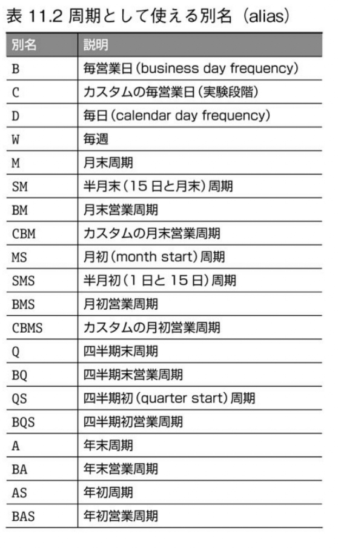

# 11. 日付/時刻データの操作
## 11.1 はじめに
**目標**
1. Python 組み込みの datetime ライブラリ
2. 文字列を日時に変換する
3. 日時のフォーマット
4. 日付の各部を抽出する
5. 日時の計算を実行する
6. DataFrame にある日時処理
7. リサンプリング（再標本化）
8. 時間帯の処理

## 11.2 Python の datetime オブジェクト

```python
from datetime import datetime
```

```python
# 現在の日付と時刻
now = datetime.now()
print(now)

# 手作業で作る
t1 = datetime.now()
t2 = datetime(1970, 1, 1)
diff = t1 - t2
print(diff)
# <class 'datetime.timedelta'>
# この引き算の結果は timedelta型となる
```

## 11.3 datetime への変換
https://pandas.pydata.org/pandas-docs/stable/reference/api/pandas.to_datetime.html

```python
import pandas as pd

ebola = pd.read_csv('data/country_timeseries.csv')

# 元データの左上隅を見る
# Date列に日付が含まれているが、infoを調べてみると
# 実際には pandas の汎用文字列オブジェクトである
print(ebola.iloc[:5, :5])

print(ebola.info())

ebola['date_dt'] = pd.to_datetime(ebola['Data'])

# より明示的に書くと,
ebola['date_dt'] = pd.to_datetime(ebola['Date'], format='%m/%d/%Y')

print(ebola.info())
```

[Pythonの「strftime() と strptime() の振る舞い」](https://docs.python.org/ja/3/library/datetime.html#strftime-and-strptime-format-codes)

## 11.4 日付を含むデータをロードする
read_csv 関数には数多くのパラメータがあるが、日付に関するパラメータは、
- `parse_dates`
- `inher_datetime_format`
- `keep_date_col`
- `date_parser`
- `dayfirst`
などだ。

https://pandas.pydata.org/pandas-docs/stable/reference/api/pandas.read_csv.html

```python
# `parse_dates` で列を指定する
ebola = pd.read_csv('data/country_timeseries.csv', parse_dates=[0])
print(ebola.info())
```

## 11.5 日付のコンポーネントを抽出する

```python
d = pd.to_datetime('2016-02-29')
print(d)
print(type(d))
# <class 'pandas._libs.tslib.Timestamp'>

print(d.year)

print(d.month)

print(d.day)
```

```python
ebola['date_dt'] = pd.to_datetime(ebola['Date'])

print(ebola[['Date', 'date_dt']].head())

ebola['year'] = ebola['date_dt'].dt.year
print(ebola[['Date', 'date_dt', 'year']].head())

ebola['month'], ebola['day'] = (
  ebola['date_dt'].dt.month,
  ebola['date_dt'].dt.day
)

print(ebola[['Date' 'date_dt', 'year', 'month', 'day']].head())

print(ebola.info())
```

## 11.6 日付の計算と timedelta

```python
print(ebola.iloc[-5:, :5])

# 最初の日付を取得
print(ebola['data_dt'].min())

ebola['outbreak_d'] = ebola['data_dt'] - ebola['date_dt'].min()

print(ebola[['Date', 'Day', 'outbreak_d']].head())

print(ebola[['Date', 'Day', 'outbreak_d']].tail())

print(ebola.info())
```

## 11.7 datetime のメソッド

```python
banks = pd.read_csv('data/banklist.csv')
print(banks.head())
```

```python
# インポートするときに、日付を直接解析できる
banks = pd.read_csv('data/banklist.csv', parse_dates=[5, 6])
print(banks.info())

# 銀行が閉鎖した四半期と年を取り出す
banks['closing_quarter'], banks['closing_year'] = \
  (banks['Closing Date'].dt.quarter,
   banks['Closing Date'].dt.year)

# それぞれの年にいくつ銀行が閉鎖したかを計算する
closing_year = banks.groupby(['closing_year']).size()

# 各年の各四半期にいくつ銀行が閉鎖したか
closing_year_q = banks.groupby(['closing_year', 'closing_quarter']).size()
```

```python
# 結果をプロットする
import matplotlib.pyplot as plt

fig, ax = plt.subplots()
ax = closing_year.plot()
plt.show()

fig, ax = plt.subplots()
ax = closing_year_q.plot()
plt.show()
```

## 11.8 株価データを取得する

```python
# pandas_datareader をインストールして利用できる
import pandas_datareader as pdr

# この例では Tesla に関する株価情報を取得する
tesla = pdr.get_data_yahoo('TSLA')

# 株価データは保存・変更しておき、今後はインターネットに依存せず、
# 同じデータセットをファイルとしてロードする
# tesla.to_csv('data/tesla_stock_yahoo.csv')
tesla = pd.read_csv('data/tesla_stock_yahoo.csv', parse_dates=[0])
```

## 11.9 日付による絞り込み

```python
# 2010年6月のデータだけが欲しい場合
print(tesla.loc[(tesla.Date.dt.year == 2015) & (tesla.Date.dt.month == 6)])
```

### 11.9.1 DatetimeIndex オブジェクト
datetimeオブジェクトをDataFrameオブジェクトのインデックスに設定したい場合

```python
tesla.index = tesla['Date']
print(desla.index)
print(tesla['2015'].iloc[:5, :5]) # ５行-５列
```

```python
# 年と月によってデータを絞り込む
print(tesla['2015-06'].iloc[:, :5]) # 全ての行-5列
```

### 11.9.2 TimedeltaIndex オブジェクト
timedeltaでインデックスを設定する場合

```python
# timedelta を作成する
tesla['ref_date'] = tesla['Date'] - tesla['Date'].min()

tesla.index = tesla['ref_date']

print(tesla.iloc[:5, :5])

# これらの増分（delta）をもとに、データを選択できる
print(tesla['0 day': '5 day'].iloc[:5, :5])
```

## 11.10 日付の範囲
データに日付が欠けていることはよくある

```python
ebola = pd.read_csv('data/country_timeseries.csv', parse_dates=[0])
print(ebola.iloc[:5, :5])
```

reindexメソッドによってインデックスを作り直すために日付の範囲を作るのは、よく行われる

```python
head_range = pd.date_range(start='2014-12-31', end='2015-01-05')

print(head_range)

# 最初の５行だけ処理する
ebola_5 = ebola.head()

# Date をインデックスとして設定する
ebola_5.index = ebola_5['Date']

# それから reindex メソッドを呼び出す

ebola_5.reindex(head_range)
print(ebola_5.iloc[:, :5]) # 全ての行-5列
```

### 11.10.1 周期
[Offset Aliases](https://pandas.pydata.org/pandas-docs/stable/user_guide/timeseries.html#offset-aliases)



```python
# これらの値は freq に渡すことができる
# 2017年1月1日を含む週の営業日
print(pd.date_range('2017-01-01', '2017-01-07', freq='B'))
```

### 11.10.2 オフセット
基本となる周期に対してバリエーションを与える

```python
# 2017年1月1日を含む週の "1日おき" の営業日
print(pd.date_range('2017-01-01', '2017-01-07', freq='2B'))

# 2017年の毎月の第１木曜日
print(pd.date_range('2017-01-01', '2017-12-31', freq='WOM-1THU'))

# 毎月の第３金曜日
print(pd.date_range('2017-01-01', '2017-12-31', freq="WOM-3FRI"))
```

## 11.11 値をシフトする

```python
import matplotlib.pyplot as plt

ebola.index = ebola['Date']

fig, ax = plt.subplots()
ax = ebola.plot(ax=ax)

# 上記の行で ValueError が発生. 上記２行目のインデックス化を行わず、下記コードにより,
# データのロード時にインデックス化と日時解析を行っておくと図11.3が表示された
# ebola = pd.read_csv('../data/country_timeseries.csv', index_col='Date', parse_dates=['Date'])

ax.legend(fontsize=7, loc=2, borderraxespad=0.)
plt.show()
```

```python
ebola_sub = ebola[['Day', 'Cases_Guinea', 'Cases_Liberia']]
print(ebola_sub.tail(10))
```

```python
ebola = pd.read_csv('data/country_timeseries.csv', index_col='Date', parse_dates=['Date'])
print(ebola.head().iloc[:, :4])
print(ebola.tail().iloc[:, :4])

new_idx = pd.date_range(ebola.index.min(), ebola.index.max())

# 日付が望ましい順序になっていない
print(new_idx)

new_idx = reversed(new_idx)
ebola = ebola.reindex(new_idx)

print(ebola.head().iloc[:, :4])
print(ebola.tail().iloc[:, :4])

# last_valid_index は欠損していない最後の値の index である
# first_valid_index は欠損していない最初の値の index である
# すべての列に対して行うために apply メソッドを使う
last_valid = ebola.apply(pd.Series.last_valid_index)
print(last_valid)

# データセットでもっとも早い日付を取得する
earliest_date = ebola.index.min()
print(earliest_date)

# この日付を last_valid の個々の日付から引いてシフト量を求める
shift_values = last_valid - earliest_date
print(shift_values)


ebola_dict = {}
for idx, col in enumerate(ebola):
    d = shift_values[idx].days
    shifted = ebola[col].shift(d)
    ebola_dict[col] = shifted

ebola_shift = pd.DateFrame(ebola_dict)
ebola_shift = ebola_shift[ebola.columns]

# インデックスを日付から Day に差し替える
ebola_shift.index = ebola_shift['Day']
ebola_shift = ebola_shift.drop(['Day'], axis=1)
```

## 11.12 リサンプリング
ここでのリサンプリング（再標本化）とは、datetime を、ある周期から別の周期に変換することである

1. ダウンサンプリング: 高い周期から、より低い周期へ（たとえば、毎日から毎月へ）
2. アップサンプリング: 低い周期から、より高い周期へ（たとえば、毎月から毎日へ）
3. 変化なし: 周期が変化しない（たとえば月の第１木曜から、月の最後の金曜へ）

リサンプルを行うには、別名を resample 関数に渡せばよい

```python
# 毎日の値を毎月の値にダウンサンプリングする. 値が複数あるので
# 結果を集約する必要があるが、ここでは平均値を使う
down = ebola.resample('M').mean()
print(down.iloc[:5, :5])

# いったんダウンサンプリングした値をアップサンプリングする
# これにより, 欠けていた日付が欠損値によって埋められる
up = down.resample('D').mean()
print(up.iloc[:5, :5])
```

## 11.13 時間帯
時間帯コンバータを自分で書こうとしてはいけない。

print(down.iloc[:5, :5])

Pythonには時間帯を扱えるよう、特別に設計された pytz というライブラリがあり、pandasでも時間帯を扱うときは、
このライブラリをラップしている

```python
import pytz

print(len(pytz.all_timezones))
```

```python
import re

regex = re.compile(r'^US')
selected_files = filter(regex.search, pytz.common_timezones)
print(list(selected_files))
```

時間帯を表す方法の１つは, pandas の Timestamp オブジェクトを使って, ２つのタイムスタンプを作ることだ
```python
# 7AM Eastern（米東部）
depart = pd.Timestamp('2017-08-29 07:00', tz='US/Eastern')
print(depart)

# 時間帯は tz_localize 関数をつかうことでも表現できる
arrive = pd.Timestamp('2017-08-29 09:57')
print(arive)

arrive = arrive.tz_localize('US/Pacific')
print(arrive)
# -> 2017-08-29 09:57:00-07:00

# フライトが到着したときに、東海岸で何時になっているかは
# 東部時間帯に変換することで知ることができる
print(arrive.tz_convert('US/Eastern'))
# -> 2017-08-29 12:57:00-04:00


# 時間帯に対する演算も可能である
# 演算を行うためには、時間帯が同じか、存在しないか、どちらかでなければならない
# 次の例は、エラーになる
duration = arrive - depart

# 飛行時間を求める
duration = arrive.tz_convert('US/Eastern') - depart
print(duration)
# -> 0 days 05:57:00
```

## 11.14 まとめ
