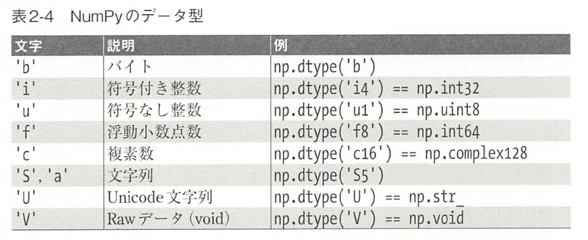
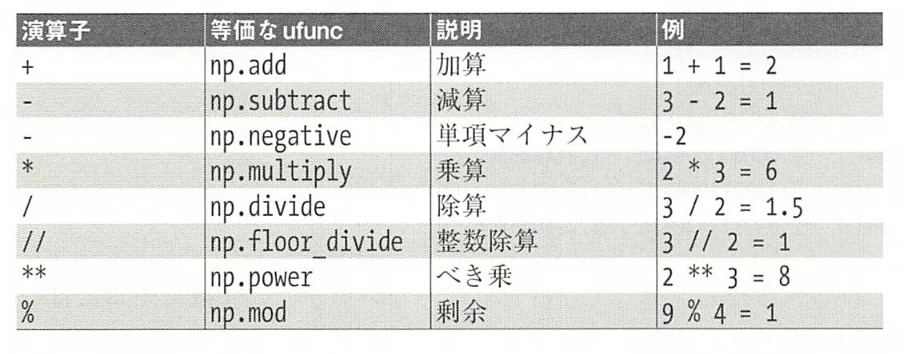
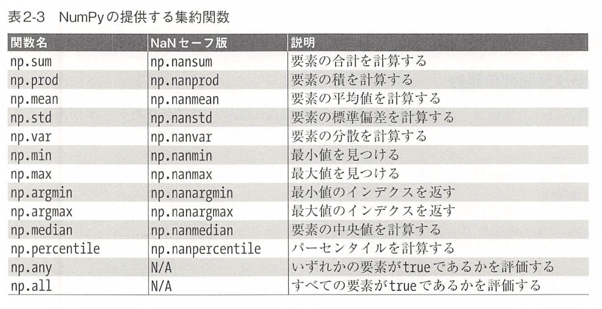

# 2. NumPy の基礎

```python
import numpy
numpy.__version__
```

## 2.1 Python のデータ型について
Pythonでは型が動的に推測されます

### 2.1.1 単なる整数ではないPythonの整数

### 2.1.2 単なるリストではないPythonのリスト

```python
L = list(range(10))
L
type(L[0])
```

```python
L2 = [str(c) for c in L]
L2
type(L2[0])
```

```python
L3 = [True, '2', 3.0, 4]
[type(item) for item in L3]
```

### 2.1.3 Python の固定型配列

```python
import array
L = list(range(10))
A = array.array('i', L)
A
# i は配列の要素が整数であることを指定する型コードです
```

NumPy の ndarray はさらに高い利便性を提供します

### 2.1.4 Python のリストから作る配列

```python
import numpy as np

# Pythonリストからの配列作成
np.array([1,4,3,2])

# NumPy配列の要素はすべて同じ型という制約があります
# 以下では、不動小数点にアップキャストされます
np.array([3.14, 4, 2 ,3])

# 配列のデータ型を明示的に設定する場合は dtypeキーワードを使用します
np.array([1,2,3,4], dtype='float32')

# NumPy配列は多次元にすることも可能
np.array([range(i, i+ 3) for i in [2, 4, 6]])
```

### 2.1.5 配列の構築

```python
# 要素がすべて0である長さが10の整数配列を作る
np.zeros(10, dtype=int)

# 要素がすべて1である3行5列の不動小数点数配列を作る
np.ones((3, 5))

# 要素がすべて3.14である3行5列の配列を作る
np.full((3, 5), 3.14)

# 開始値0, 終了値20で2ずつ増加する線形シーケンス配列を作る
np.arange(0, 20, 2)

# 0と1の間に均等に配置された5つの値の配列を作る
np.linspace(0, 1, 5)

# 0と1の間に均一に分布したランダムな値の3行3列の配列を作る
np.random.random((3, 3))

# 平均0と標準偏差1の正規分布乱数で3行3桁の配列を作る
np.random.normal(0, 1, (3, 3))

# 区間[0, 10) （0以上10未満）のランダムな整数で3行3桁の配列を作る
np.random.randint(0, 10, (3, 3))

# 3行3列の単位行列を作る
np.eye(3)

# 3つの整数の初期化されていない配列を作る
# 各要素の値は, そのメモリ位置にすでに存在していたものになる
np.empty(3)
```

### 2.1.6 NumPy の標準データ型

```python
# 文字列を使用して指定できます
np.zeros(10, dtype='int16')

# または、関連するNumPyオブジェクトを使用します
np.zeros(10, dtype=np.int16)
```



## 2.2 NumPy 配列の基礎

### 2.2.1 NumPy 配列の属性

```python
import numpy as np

# 同じ乱数を得るために, 乱数シードを設定する
np.random.seed(0)

x1 = np.random.randint(10, size=6) # 1次元配列
x2 = np.random.randint(10, size=(3, 4)) # 2次元配列
x3 = np.random.randint(10, size=(3, 4, 5)) # 3次元配列

# 各配列には, 属性として ndim（次元数), shape（各次元のサイズ）, size（配列の合計サイズ）を持ちます
print('x3 ndim:', x3.ndim)
print('x3 shape:', x3.shape)
print('x3 size:', x3.size)
print('x3 dtype:', x3.dtype)
print('x3 itemsize:', x3.itemsize)
print('x3 nbytes:', x3.nbytes)
```

### 2.2.2 配列インデクス: 配列の要素にアクセスする

```python
x1
x1[0]
x1[4]
x1[-1]
x1[-2]

x2
x2[0, 0]
x2[2, 0]
x2[2, -1]

# インデクスを使って値を変更できます
x2[0, 0] = 12

# 配列は固定型
# 以下では, x1はint型なので小数点は切り捨てられます
x1[0] = 3.14
```

### 2.2.3 配列のスライス: 部分配列にアクセスする

```python
x[start:stop:step]
```

### 2.2.3.1 1次元配列のスライス

```python
x = np.arange(10)

# 最初の５要素
x[:5]

# インデクス5以降の要素
x[5:]

# 中間の部分配列
x[4:7]

# 1つおきの要素
x[::2]

# インデクス1から始まる1つおきの要素
x[1::2]

# 逆順に全ての要素
x[::-1]

# インデクス5から逆順に1つおきの要素
x[5::-2]
```

#### 2.2.3.2 多次元配列のスライス

```python
x2

# 2行と3列
x2[:2, :3]

# すべての行と, 1つおきの列
x2[:3, ::2]

# すべての行を一度に逆順
x2[::-1, ::-1]

# x2の最初の列
print(x2[:, 0])

# x2の最初の行
print(x2[0, :])

# 空のスライスを省略（x2[0, :]）
print(x2[0])
```

#### 2.2.3.3 ビューとしての部分配列

```python
# ２行２列の部分配列を抽出
x2_sub = x2[:2, :2]

# この部分配列を変更すると, 元の配列も変更される
x2_sub[0, 0] = 99
print(x2_sub)
print(x2)
```

#### 2.2.3.4 配列のコピー

```python
x2_sub_copy = x2[:2, :2].copy()

# この部分配列を変更しても, 元の配列には影響しない
x2_sub_copy[0, 0] = 42

print(x2_sub_copy)
print(x2)
```

## 2.2.4 配列の形状変更

```python
grid = np.arange(1, 10).reshape((3, 3))
print(grid)
```

```python
x = np.array([1, 2, 3])

# reshapeを用いた行ベクトルの作成
x.reshape((1, 3))

# newaxis を用いた行ベクトルの作成
x[np.newaxis, :]

# reshapeを用いた列ベクトルの作成
x.reshape((3, 1))

# newaxisを用いた列ベクトルの作成
x[:, np.newaxis]
```

### 2.2.5 配列の連結と分割
配列の連結または結合は、主に np.concatenate, np.vstack, np.hstack によって実行します

```python
x = np.array([1, 2, 3])
y = np.array([3, 2, 1])
np.concatenate([x, y])

z = [99, 99, 99]
np.concatenate([x, y, z])

# ２次元配列
grid = np.array([[1,2,3], [4, 5, 6]])

np.concatenate([grid, grid]) # 第１の軸に沿って連結する

np.concatenate([grid, grid], axis=1) # 第２の軸に沿って連結する
```

```python
x = np.array([1, 2, 3])
grid = np.array([[9,8,7], [6,5,4]])
# 配列を垂直に重ねる
np.vstack([x, grid])

# 配列を水平に重ねる
y = np.array([[99], [99]])

np.hstack([grid, y])
```

#### 2.2.5.2 配列の分割

```python
x = [1,2,3,99,99,3,2,1]
x1, x2, x3 = np.split(x, [3, 5])

grid = np.arange(16).reshape((4, 4))
upper, lower = np.vsplit(grid, [2])
print(upper)
print(lower)

left, right = np.hsplit(grid, [2])
```

## 2.3 NumPy配列の計算: ユニバーサル関数
### 2.3.1 低速なループ処理
- [PyPy](http://pypy.org/)
- [Cython](http://cython.org/)
- [Numba](http://numba.pydata.prg/)

```python
import numpy as np
np.random.seed(0)

def compute_reciprocals(values):
    output = np.empty(len(values))
    for i in range(len(values)):
        output[i] = 1.0 / values[i]
    return output

values = np.random.randint(1, 10, size=5)
compute_reciprocals(values)
```

```python
big_array = np.random.randint(1, 100, size=1000000)
%timeit compute_reciprocals(big_array)
```

### 2.3.2 ufuncの紹介

```python
print(compute_reciprocals(values))
```

```python
x = np.arange(9).reshape((3, 3))
2 ** x
```

### 2.3.3 NumPy ufuncの調査

```python
x = np.arange(4)
print('x     =', x)
print('x + 5 =', x + 5)
print('x - 5 =', x - 5)
print('x * 2 =', x * 2)
print('x / 2 =', x / 2)
print('x // 2 =', x // 2)

print('-x     =', -x)
print('x ** 2 =', x ** 2)
print('x % 2 =', x % 2)

-(0.5 * x + 1) ** 2

np.add(x, 2)
```

**NumPyに実装された算術演算し**<br>


#### 2.3.3.2 絶対値

```python
x = np.array([-2, -1, 0, 1, 2])
abs(x)
np.absolute(x)
np.abs(x)

x = np.array([3 - 4j, 4 - 3j, 2 + 0j, 0 + 1j])
np.abs(x)
```

#### 2.3.3.3 三角関数

```python
theta = np.linspace(0, np.pi, 3)

print('theta      =', theta)
print('sin(theta) =', np.sin(theta))
print('cos(theta) =', np.cos(theta))
print('tan(theta) =', np.tan(theta))
```

```python
x = [-1, 0, 1]

print('x         =', x)
print('arcsin(x) =', np.arcsin(x))
print('arccos(x) =', np.arccos(x))
print('arctan(x) =', np.arctan(x))
```

#### 2.3.3.4 指数関数と対数関数

```python
x = [1, 2, 3]

print('x    =', x)
print('e^x  =', np.exp(x))
print('2^x  =', np.exp2(x))
print('3^x  =', np.power(3, x))
```

```python
x = [1, 2, 3, 10]

print('x        =', x)
print('ln(x)    =', np.log(x))
print('log2(x)  =', np.log2(x))
print('log10(x) =', np.log10(x))
```

```python
x = [0, 0.001, 0.01, 0.1]

print('exp(x) - 1 =', np.expm1(x))
print('log(1 + x) =', np.log1p(x))
```

#### 2.3.3.5 特殊のufunc

```python
from scipy import special

# ガンマ関数（階乗を一般化したもの）およびその関連
x = [1, 5, 10]

print('gamma(x)     =', special.gamma(x))
print('ln|gamma(x)| =', special.gammaln(x))
print('beta(x, 2)   =', special.beta(x, 2))
```

```python
# 誤差関数（ガウス関数の積分）および
# 相補誤差関数と逆誤差関数
x = np.array([0, 0.3, 0.7, 1.0])

print('erf(x)    =', special.erf(x))
print('erfc(x)   =', special.erfc(x))
print('erfinv(x) =', special.erfinv(x))
```

### 2.3.4 高度なufuncの機能
#### 2.3.4.1 出力の指定

```python
x = np.arange(5)
y = np.empty(5)
np.multiply(x, 10, out=y)
print(y)
```

```python
y = np.zeros(10)
np.power(2, x, out=y[::2])
print(y)
```

#### 2.3.4.2 集約

```python
x = np.arange(1, 6)

# reduceは, 結果が1つになるまで配列の要素に繰り返し演算を適用します
np.add.reduce(x)

np.multiply.reduce(x)

# 中間結果を残したい場合は, accumulate を使います
np.add.accumulate(x)

np.multiply.accumulate(x)
```

#### 2.3.4.3 外積

```python
x = np.arange(1, 6)
np.multiply.outer(x, x)
```
### 2.3.5 ufunc: より深く学ぶために

- [NumPy](https://www.numpy.org)
- [SpiPy](https://www.scipy.org/)

## 2.4 集約: 最大、最小、その他データの間にあるもの

大量のデータに対峙した際、一番最初に行うのはデータの要約統計量を計算することです。
おそらく、もっとも一般的な要約統計量は平均と標準偏差であり、データセットの「典型的な」値について知識を与えてくれます

### 2.4.1 配列を合計する

```python
import numpy as np
L = np.random.random(100)
sum(L)
```

```python
big_query = np.random.rand(1000000)
sum(big_query)
np.sum(big_query)
```

### 2.4.2 最大と最小

```python
min(big_query), max(big_query)
np.min(big_query), np.max(big_query)
```

min, max, sum, およびその他のいくつかの集約を行うには、配列オブジェクトのメソッドを使用する方が簡単です

```python
big_query.min()
big_query.max()
big_query.sum()
```

#### 2.4.2.1 多次元配列の集約

```python
M = np.random.random((3, 4)) # ３行４列
M.sum()
```

```python
# axis=0 を指定すると, 各列内の最小値を見つけることができます
M.min(axis=0)

# 同様に各行内の最大値を見つけることもできます
M.max(axis=1)
```

#### 2.4.2.2 その他の集約関数




### 2.4.3 事例: 米国大統領の平均身長は？

```python
import pandas as pd
data = pd.read_csv('data/president_heights.csv')
heights = np.array(data['height(cm)'])
print(heights)

print('Mean height:      :', heights.mean())
print('Standard deviation:', heights.std())
print('Minimum height    :', heights.min())
print('Maximum height    :', heights.max())

print('25th percentile   :', np.percentile(heights, 25))
print('Median            :', np.median(heights))
print('75th percentile   :', np.percentile(heights, 75))
```

```python
%matplotlib inline
importmatplotlib.pyplot as plt
import seaborn
seaborn.set() # set plot style

plt.hist(heights)
plt.title('Height Distribution of US Presidents')
plt.xlabel('height(cm)')
plt.ylabel('number')
```

## 2.5 配列の計算: ブロードキャスト

ブロードキャストは, 異なるサイズの配列に対して二項ufunc（加算, 減算, 乗算など）を適用するための一連のルールです

### 2.5.1 ブロードキャストの基礎
同じサイズの配列の場合, 二項演算は要素ごとに実行されることを思い出してください

```python
import numpy as np

a = np.array([0, 1, 2])
b = np.array([5, 5, 5])
a + b
> array([5, 6, 7])
```

ブロードキャストでは, この種の二項演算を異なるサイズに対して実行できます.
例えば, **スカラー（ゼロ次元の配列と考える）** と配列の加算がそのまま行えます

```python
a + 5
# 値5を配列[5,5,5]に引き伸ばして計算される
```

２次元配列と１次元配列の加算

```python
M = np.ones((3, 3))
M + a

# １次元配列aは, 配列Mの形状に一致するように引き伸ばされる
```

より複雑なケース

```python
a = np.arange(3)
b = np.arange(3)[:, np.newaxis]
a + b
```

### 2.5.2 ブロードキャストのルール

1. ２つの配列の次元数が異なる場合, 次元数の少ない方の形状は, 先頭（左側）に１を**補い**次元数を揃える
2. ２つの配列の形状がいずれの次元でも一致しない場合, 各次元のうち長さが１に等しい次元は, 他方の配列形状と一致するように引き伸ばされる
3. いずれかの次元でサイズが不一致で, 長さが１に等しくもない場合はエラーとなる

#### 2.5.2.1 ブロードキャスト例１

```python
M = np.ones((2, 3))
a = np.arange(3)

M.shape = (2, 3)
a.shape = (3,)

# ルール1により, 配列aの次元数が少ないので, 先頭に1を補います
M.shape -> (2, 3)
a.shape -> (1, 3)

# ルール2により, 最初の次元が不一致であることから, この次元を次のように一致させます
M.shape -> (2, 3)
a.shape -> (2, 3)

# これで形状が一致して, ２行３列の2次元配列となります
```

#### 2.5.2.2 ブロードキャスト例２

```python
a = np.arange(3).reshape((3, 1))
b = np.arange(3)

a.shape = (3, 1)
b.shape = (3,  )

# ルール1により, bの形状に1を補う必要があります
a.shape -> (3, 1)
b.shape -> (1, 3)

# ルール2では, 他方の配列の対応サイズと一致するように, 長さが1の次元をそれぞれ引き伸ばします
a.shape -> (3, 3)
b.shape -> (3, 3)

a + b
```

#### 2.5.2.3 ブロードキャスト例３
２つの配列に互換性がない例

```python
M = np.ones((3, 2))
a = np.arange(3)


M.shape = (3, 2)
a.shape = (3, )

# ルール1により aの形を補う必要があります
M.shape -> (3, 2)
a.shape -> (1, 3)

# ルール2により, aの1番目の次元をMに一致するように引き伸ばします
M.shape -> (3, 2)
a.shape -> (3, 3)

# ここでルール３に該当して最終的な形状が一致しないため, この２つの配列は互換性がありません
```

```python
# 明示的に軸の再構成を行う newaxis
a[: np.newaxis].shape

M + a[:, np.newaxis]
```

### 2.5.3 ブロードキャストの実践
#### 2.5.3.1 配列のセンタリング

```python
# 集約関数 mean を使って1番目の次元に沿って各値の平均を計算
X = np.random.random((10, 3))
Xmean = X.mean(0)

# X配列から平均を引いて, センタリング配列を作ります（この操作はブロードキャストです）
X_centered = X -Xmean

X_centered.mean(0)
```

#### 2.5.3.2 ２次元関数のプロット

```python
# xとyは0から5の間で, 50ステップの値をとる
x = np.linspace(0, 5, 50)
y = np.linspace(0, 5, 50)[:, np.newaxis]
z = np.sin(x) ** 10 + np.cos(10 + y * x) * np.cos(x)
```

```python
%matplotlib inline
import matplotlib.pyplot as plt

plt.imshow(z, origin='lower', extent=[0, 5, 0, 5])
plt.colorbar()
```

## 2.6 比較, マスク, ブール値
マスキングは, 何らかの基準に基づいて配列なの値を抽出, 変更, カウントするなどの操作を行う場合に使用します

### 2.6.1 事例: 雨天日数

```python
import numpy as np
import pandas as pd

# pandasを使用して降水量（インチ）をNumPy配列として読み込む
rainfall = pd.read_csv('data/Seattle2014.csv')['PRCP'].values
inches = rainfall / 254 # 1/10mmをインチに変換する
inches.shape
```

```python
%matplotlib inline
import matplotlib.pyplot as plt
import seaborn
seaborn.set()

plt.hist(inches, 40)
```

#### 2.6.1.1 データの深堀り
- 手作業で対応するのは非効率
- ufuncを使って配列に対する要素ごとの比較を行い, その結果に操作を施す

### 2.6.2
NumPyは比較演算子をufuncとして実装します

```python
x = np.array([1,2,3,4,5])

x < 3
# -> array([ True,  True, False, False, False])
x > 3
x <= 3
x >= 3
x != 3
x == 3
(2 * x) == (x ** 2)
```

```python
rng = np.random.RandomState(0)
x = rng.randint(10, size=(3, 4))
```

### 2.6.3 ブール値配列の操作

```python
print(x)
```

#### 2.6.3.1 要素のカウント

ブール値配列の True の数を数えるには, np.count_nonzero を使います

```python
np.count_nonzero(x < 6)

# np.sum を使用しても計算できます
# この場合, Falseは0と解釈され, Trueは1と解釈されます
np.sum(x < 6)

# sum() の利点は, 行または列に沿った集約も可能であるという点です
np.sum(x < 6, axis=1)
```

```python
# 値の一部またはすべてが True であるかどうかを素早く確認したい場合は, np.any() または np.all() を使用します

np.any(x > 8) # 8より大きい値の有無
np.any(x < 0) # 0より小さい値の有無
np.all(x < 10) # すべての値が10より小さいか
np.all(x == 6) # すべての値が6と等しいか

# 特定の軸に沿って np.all() と np.any() をしようすることもできます
np.all(x < 8, axis=1) # 各行ごとにすべての値が8より小さいか
```

#### 2.6.3.2 ブール演算子

```python
np.sum((inches > 0.5) & (inches < 1))
# A AND B == NOT(NOT A OR NOT B)
np.sum(~( (inches <= 0.5) | (inches >= 1) ))
```

```python
print('Number days without rain:', np.sum(inches == 0))
print('Number days with rain:', np.sum(inches != 0))
print('Days with more than 0.5 inches:', np.sum(inches > 0.5))
print('Rainy days with < 0.1 inches:', np.sum((inches > 0) & (inches < 0.2)))
```

### 2.6.4 マスクとしてのブール値配列

