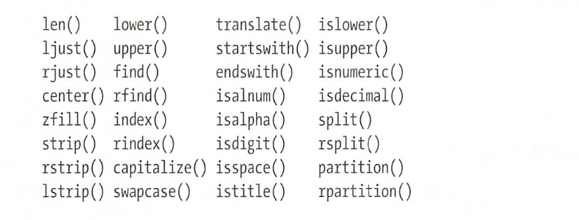
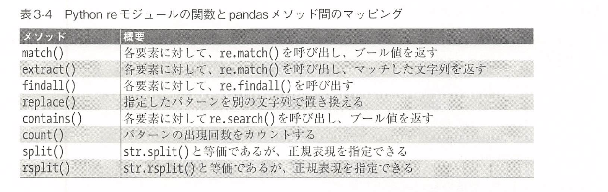
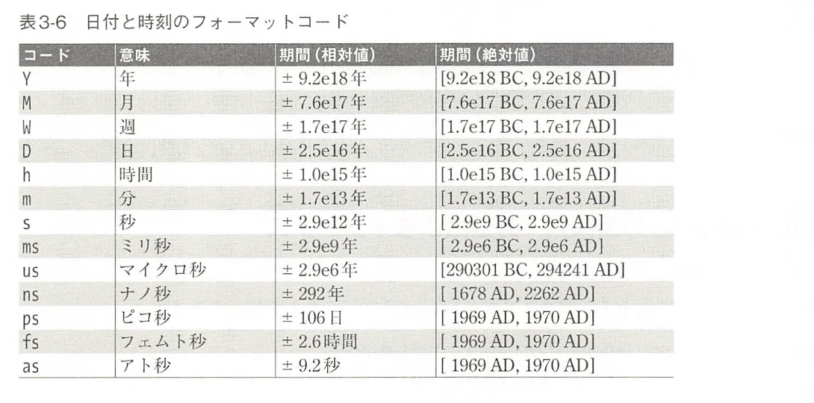
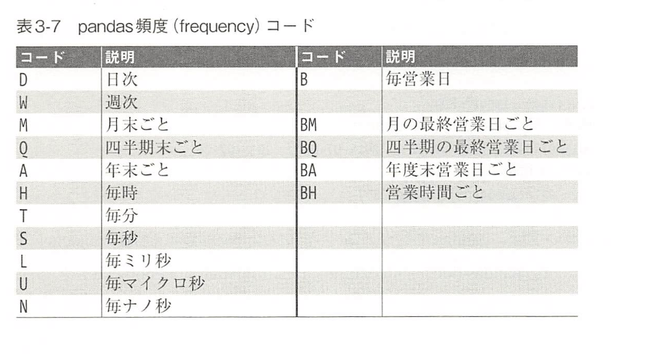

# 3. pandasを使ったデータ操作
<sup>118~238</sup>

## 3.1 pandas のインストールと使用方法

```python
import pandas
pands.__version__
```

## 3.2 pandas オブジェクトの基礎
pandasオブジェクトとは行と列が単純な整数インデクスではなくラベルで識別できるNumPy構造化配列の拡張版と考えることができます

```python
import numpy as np
import pandas as pd
```

### 3.2.1 Seriesオブジェクト

```python
data = pd.Series([0.25, 0.5, 0.75, 1.0])
data

# values は, おなじみのNumPy配列です
data.values

data.index

data[1]

data[1:3]
```

#### 3.2.1.1 一般化NumPy配列としてのSeries
- SeriesとNumPy配列の本質的な違いはインデクス
  - NumPy配列は暗黙的に定義された整数インデクス
  - Seriesには値に関連付けられた明示的に定義されたインデクス

```python
data = pd.Series([0.25, 0.5, 0.75, 1.0], index=['a', 'b', 'c', 'd'])
data

data['b']

# インデクスは連続していなくても, 順番に並んでいなくても構いません
data = pd.Series([0.25, 0.5, 0.75, 1.0], index=[2, 5, 3, 7])
data

data[5]
```

#### 3.2.1.2 特殊辞書としてのSeries
Python辞書から直接Seriesを構築することで, Seriesが辞書の１種であるという比喩をもっと明確にできます.

```python
population_dict = {
  'California': 38332521,
  'Texas': 26448193,
  'New York': 19651127,
  'Florida': 19552860,
  'Illinois': 12882135
}

population = pd.Series(population_dict)
population

population['California']

population['California':'Illinois']
```

#### 3.2.1.3 Seriesオブジェクトの作成

```python
pd.Series([2, 4, 6])

pd.Series(5, index=[100, 200, 300])

pd.Series({2: 'a', 1: 'b', 3: 'c'})

pd.Series({2: 'a', 1: 'b', 3: 'c'}, index=[3,2])
```

### 3.2.2 DataFrameオブジェクト

#### 3.2.2.1 一般化NumPy配列としてのDataFrame
DataFrame は, 柔軟な行インデクスと柔軟な列名の両方を持つ２次元配列に例えられます

```python
area_dict = {
    'California': 423967,
    'Texas': 695662,
    'New York': 141297,
    'Florida': 170372,
    'Illinois': 149995
}
area = pd.Series(area_dict)
area

states = pd.DataFrame({
    'population': population,
    'area': area
})
states

states.index
states.columns
```

#### 3.2.2.2 特殊辞書としてのDataFrame

```python
states['area']
```

#### 3.2.2.3 DataFrameオブジェクトの作成
**Seriesオブジェクトから作成する**

```python
pd.DataFrame(population, columns=['population'])
```

**辞書のリストから作成する**

```python
data = [{'a': i, 'b': 2 * i} for i in range(3)]
pd.DataFrame(data)

# 辞書内にいくつか値が見つからなくても, pandasはそれらをNaN値で埋めます
pd.DataFrame([{'a': 1, 'b': 2}, {'b': 3, 'c': 4}])
```

**Seriesオブジェクトの辞書から作成する**

```python
pd.DataFrame({
    'population': population,
    'area': area
})
```

**２次元NumPy配列から作成する**

```python
pd.DataFrame(np.random.rand(3, 2), columns=['foo', 'bar'], index=['a', 'b', 'c'])
```

**NumPy構造化配列から作成する**

```python
A = np.zeros(3, dtype=[('A', 'i8'), ('B', 'f8')])
pd.DataFrame(A)
```

### 3.2.3 Indexオブジェクト

```python
ind = pd.Index([2,3,5,7,11])
ind
```

#### 3.2.2.1 不変配列としてのIndex

```python
ind[1]

ind[::2]

print(ind.size, ind.shape, ind.ndim, ind.dtype)
```

IndexオブジェクトとNumPy配列の違いの１つは, インデクスが不変であることです

```python
ind[1] = 0
```

#### 3.2.3.2 順序付き集合（set）としてのIndex
- 和集合（union）
- 積集合（intersection）
- 差集合（difference）

```python
indA = pd.Index([1,3,5,7,9])
indB = pd.Index([2,3,5,7,11])

indA & indB # 積集合（どちらにも含まれる）

indA | indB # 和集合（すべて）

indA ^ indB # 差集合（片方だけに含まれる）
```

## 3.3 インデクスとデータの選択

### 3.3.1 Seriesのデータ選択
#### 3.3.1.1 辞書としてのSeries

```python
import pandas as pd
data = pd.Series([0.25, 0.5, 0.75, 1.0], index=['a', 'b', 'c', 'd'])
data

data['b']

'a' in data

data.keys()

list(data.items())

data['e'] = 1.25
```

#### 3.3.1.2 １次元配列としてのSeries

```python
# 明示的なインデクスによるスライス
data['a':'c']

# 間接的な整数インデクスによるスライス
data[0:2]

# マスク
data[(data > 0.3) & (data < 0.8)]

# ファンシーインデクス
data[['a', 'b']]
```

#### 3.3.1.3 インデクス属性: loc, iloc: ix

```python
data = pd.Series(['a', 'b', 'c'], index=[1, 3, 5])
data

# 明示的なインデクス指定
data[1]

# スライスの場合の, 間接的な指定
data[1:3]
```

```python
# loc属性
# 明示的なインデクスを使ったインデクスおよびスライス
data.loc[1]
data.loc[1:3]

# iloc属性
# 間接的なPythonスタイルのインデクスを使ったインデクスとスライス
data.iloc[1]
data.iloc[1:3]
```

### 3.3.2 DataFrameのデータ選択
#### 3.3.2.1 辞書としてのDataFrame

```python
area = pd.Series({
    'California': 42369,
    'Texas': 695543,
    'New York': 141295,
    'Florida': 170327,
    'Illinois': 149953
})
pop = pd.Series({
    'California': 38335422,
    'Texas': 2644987,
    'New York': 1965789,
    'Florida': 1955280,
    'Illinois': 12880934
})

data = pd.DataFrame({
    'area': area,
    'pop': pop
})
data

data['area']
data.area
data.area is data['area']

data['density'] = data['pop'] / data['area']
```

#### 3.3.2.2 ２次元配列としてのDataFrame

```python
data.values

# DataFrameを転置して行
と列を交換できます
data.T
```

```python
# 配列形式に対してインデクスを１つ指定すると, 行が返る
data.values[0]

# DataFrameにインデクスを１つ指定すると列が返る
data['area']
```

DataFrameに配列形式のインデクスを使うには, loc, iloc, ix を使う

```python
data.iloc[:3, :2]

data.loc[:'Illinois', :'pop']

data.ix[:3, :'pop']
```

* ixはdeprecated

```python
# locを使って, マスクとファンシーインデクスを組み合わせる
data.loc[data.density > 100, ['pop', 'density']]

data.iloc[0, 2] = 90 # 1行3列
data
```

#### 3.3.2.3 その他のインデクス規則
**インデクス**は列を参照しますが, **スライス**は行を参照します

```python
# スライスは行を参照します
data['Florida':'Illinois']
data[1:3]

# マスキング操作も行に対して解釈されます
data[data.density > 50]
```

## 3.4 pandasデータの操作

### 3.4.1 ufunc: インデクスの保存
```python
import pandas as pd
import numpy as np

rng = np.random.RandomState(42)
ser = pd.Series(rng.randint(0, 10, 4))
ser


df = pd.DataFrame(rng.randint(0, 10, (3, 4)), columns=['A', 'B', 'C', 'D'])
df

# これらのオブジェクトにNumPy ufuncを適用すると, 結果はインデクスが保存された別のpandasオブジェクトになります

np.exp(ser)
np.sin(df * np.pi / 4)
```

### 3.4.2 ufunc: インデクスの整列
２つの異なるデータソースを結合し, 米国の面積上位3つの州と 人口上位3つの州を検索する

```python
area = pd.Series({
    'Alaska':  172337,
    'Texas': 695662,
    'California': 423697
}, name='area')

population = pd.Series({
    'California': 38332521,
    'Texas': 26448193,
    'New York': 19651127
}, name='population')

population / area
# 結果の配列は, 和集合で構成されます

area.index | population.index
```

```python
A = pd.Series([2,4,6], index=[0,1,2])
B = pd.Series([1,3,5], index=[1,2,3])
A + B

# 欠損値を埋める値を明示的に指定することができます
A.add(B, fill_value=0)
```

#### 3.4.2.2 DataFrame オブジェクトのインデクス整列

```python
A = pd.DataFrame(rng.randint(0, 20, (2, 2)), columns=list('AB'))
B = pd.DataFrame(rng.randint(0, 10, (3, 3)), columns=list('BAC'))
A + B # この結果には欠損値がある

fill = A.stack().mean()
A.add(B, fill_value=fill)
```

### 3.4.3 ufunc: DataFrameとSeriesの演算
DataFrameとSeries間で操作を実行する場合, インデクスと列の配置も同時に維持されます

```python
# 2次元配列と, その中の1行との差を計算します
A = rng.randint(10, size=(3, 4))
A

A - A[0]
```

NumPy のブロードキャストルールによると, 2次元配列とその中の1行との減算は, 行単位で行われます.

```python
df = pd.DataFrame(A, columns=list('QRST'))
df - df.iloc[0]
# pandas でもデフォルトでは行単位で計算が行われます

# 列単位で操作する場合は, axisキーワードを指定することで可能になります
df.subtract(df['R'], axis=0)

# DataFrame と Series との操作は, 2つの要素間のインデクスが自動的に揃えられます
halfrow = df.iloc[0, ::2]
halfrow

df - halfrow
```

## 3.5 欠損値の扱い
欠落しているデータを一般的に **null値**, **NaN値**, または **NA値**と呼びます.

### 3.5.1 欠損値表現のトレードオフ

### 3.5.2 pandas の欠損値

### 3.5.2.1 None: Pythonの欠損値

```python
import numpy as np
import pandas as pd

vals1 = np.array([1, None, 3, 4])
vals1
```

#### 3.5.2.2 NaN: 数値データの欠損値

```python
vals2 = np.array([1, np.nan, 3, 4])
vals2.dtype

# NaNはデータに対する一種のウイルスのようなもので, 他のあらゆるオブジェクトに感染します.
# つまり, 演算に関係なくNaNをしようした　算術演算の結果は, NaNになります
vals2.sum(), vals2.min(), vals2.max()

# NumPy はこれらの欠損値を無視する特別な集約手段を提供しています
np.nansum(vals2), np.nanmin(vals2), np.nanmax(vals2)
```

#### 3.5.2.3 pandas における NaN と None

```python
pd.Series([1, np.nan, 2, None])

x = pd.Series(range(2), dtype=int)
x

x[0] = None
x
# None は自動的にNaNに変換saremasu
```

### 3.5.3 null値が存在する場合の処理

null値を検出, 削除, および置換するための有用なメソッドがいくつかあります

- isnull() - 欠損値の存在を示すブール値マスク配列を作成する
- notnull() - isnull() の逆
- dropna() - データから欠損値を取り除いたデーターを作る
- fillna() - 不足している要素に値を埋め込んだデータのコピーを返す

#### 3.5.3.1 null値の検出
isnull(), notnull()

```python
data = pd.Series([1, np.nan, 'hello', None])
data.isnull()
data[data.notnull()]
```

#### 3.5.3.2 欠損値の除外
dropna(), fillna()

```python
data.dropna()
```

```python
df = pd.DataFrame([
  [1, np.nan, 2],
  [2, 3, 5],
  [np.nan, 4, 6]
])

df.dropna()
# dropna() は null値が存在するすべての行を削除します

df.dropna(axis='columns')
```

```python
df[3] = np.nan
df

# how='all' を指定することで, すべての要素がnull値である行/列のみが削除されます
df.dropna(axis='columns', how='all')

# threshパラメータを使用して, 行または列を維持するためのnull以外の値の最小個数を指定できます
# (null値以外の要素がN個以上ある)
df.dropna(axis='rows', thresh=3)
```

#### 3.5.3.3 欠損値への値設定

```python
data = pd.Series([1, np.nan, 2, None, 3], index=list('abcde'))
data

# 欠損値を0で埋める
data.fillna(0)

# 欠損値を, 欠損値の一つ前の値を埋める（forward fill）
data.fillna(method='ffill')

# 欠損値を, 欠損値の一つ後ろの値を埋める（back fill）
data.fillna(method='bfill')
```

```python
df

df.fillna(method='ffill', axis=1)
```

forward fill を行う際に前の値が利用できない場合, NA値が残る点に注意が必要です

## 3.6 階層型インデクス

```python
import pandas as pd
import numpy as np
```

### 3.6.1 多重インデクスを持つSeries
1次元のSeriesで2次元データを表現する方法

#### 3.6.1.1 誤った手法

```python
index = [
    ('California', 2000),
    ('California', 2010),
    ('New York', 2000),
    ('New York', 2010),
    ('Texas', 2000),
    ('Texas', 2010)
]
populations = [
    33871648,
    37253956,
    18976457,
    19378102,
    20185182,
    25145561,
]
pop = pd.Series(populations, index=index)

pop[('California', 2010):('Texas', 2000)]
```

```python
pop[[i for i in pop.index if i[1] == 2010]]
```

#### 3.6.1.2 より良い手法: MultiIndex

```python
index = pd.MultiIndex.from_tuples(index)
index
```

```python
pop = pop.reindex(index)
pop
```

```
# この結果は, 指定したキーを１つだけ持つインデクス付き配列になります
pop[:, 2010]
```

#### 3.6.1.3 多次元に対する MultiIndex
unstack() メソッドは, 多重インデクスを使ったSeriesを, 一般的なインデクス付きDataFrameに変換します.

```python
pop_df = pop.unstack()
pop_df
```

もちろん stack() メソッドは逆の操作を行います.

```python
pop_df.stack()
```

多重インデクスを使えば１次元のSeries内で２次元を表せるように, SeriesやDataFrameで３次元以上のデータを表せるからです

```python
pop_df = pd.DataFrame({
    'total': pop,
    'under18': [
        9267089, 9284094,
        4689743, 4318033,
        5906301, 6879014
    ]
})
```

### 3.6.2 MultiIndex の作成方法

```python
df = pd.DataFrame(
    np.random.rand(4, 2),
    index=[['a', 'a', 'b', 'b'], [1, 2, 1, 2]],
    columns=['data1', 'data2']
)
```

### 3.6.2.1 明示的なMultiIndexの作成
pd.MultiIndex

```python
# 配列のリストから MultiIndex を作成
pd.MultiIndex.from_arrays([['a', 'a', 'b', 'b'], [1, 2, 1, 2]])

# タプルのリストから MultiIndex を作成
pd.MultiIndex.from_tuples([('a', 1), ('a', 2), ('b', 1), ('b', 2)])

# それぞれのインデクスのデカルト積から MultiIndex を作成
pd.MultiIndex.from_product([['a', 'b'], [1, 2]])
```

#### 3.6.2.2 MultiIndexのレベル名
names引数を渡すか, sakuseigoniインデクスのnames属性を設定する

```python
pop.index.names = ['state', 'year']
```

#### 3.6.2.3 列に対するMultiIndex

```python
# 階層化した列とインデクス
index = pd.MultiIndex.from_product([[2013, 2014], [1, 2]], names=['year', 'visit'])
columns = pd.MultiIndex.from_product([['Bob', 'Guido', 'Sue'], ['HR', 'Temp']], names=['subject', 'type'])

# データは適当に埋める
data = np.round(np.random.randn(4, 6), 1)
data[:, ::2] *= 10
data += 37

# DataFrame の作成
health_data = pd.DataFrame(data, index=index, columns=columns)
health_data
```

### 3.6.3 MultiIndex のインデクス指定とスライス
#### 3.6.3.1 多重インデクスSeries

```python
pop['California', 2000]

pop['California']

pop[:, 2000]

pop[pop > 2200000]

pop[['California', 'Texas']]
```

#### 3.6.2.2 多重インデクスDataFrame
DataFrameでは列が優先され, 多重インデクス付きSeriesで使用した構文は列に適用されることに注意してください

```python
health_data

health_data['Guido', 'HR']

# loc, iloc を使用することもできます
health_data.iloc[:2, :2]

# loc, iloc はタプルを使って複数のインデクスを指定できます
health_data.loc[:, ('Bob', 'HR')]

# タプル内のインデクスにはスライスを指定できません
health_data.loc[(:, 1), (:, 'HR')] # 構文エラー

# 
idx = pd.IndexSlice
health_data.loc[idx[:, 1], idx[:, 'HR']]
```

### 3.6.4 多重インデクスの並べ替え

```python
index = pd.MultiIndex.from_product([['a', 'c', 'b'], [1, 2]])
data = pd.Series(np.random.rand(6), index=index)
data.index.names = ['char', 'int']

try:
    data['a':'b']
except KeyError as e:
    print(type(e))
    print(e)
```

```python
data = data.sort_index()
data
```

```python
data['a':'b']
```

#### 3.6.4.2 インデクスのstackのunstack
２次元に変換する場合, 必要に応じてレベルを指定することもできます

```python
pop.unstack(level=0)

pop.unstack(level=1)

# unstack()の逆操作stack()を用いて元のSeriesを復元できます
pop.unstack().stack()
```

#### 3.6.4.3 インデクスの設定と再設定

```python
pop_flat = pop.reset_index(name='population')
pop_flat
```

```python
pop_flat.set_index(['state', 'year'])
```

### 3.6.5 多重インデクスに基づいたデータ集約
mean(), sum(), max() など

```python
health_data

# レベルを指定した平均
data_mean = health_data.mean(level='year')
data_mean

# axis キーワードを使用すれば, 列レベル間での平均が得られます
data_mean.mean(axis=1, level='type')
```

## 3.7 データセットの連結: concatとappend

```python
import pandas as pd
import numpy as np
```

```python
def make_df (cols, ind):
    """DataFrameの簡易作成関数"""
    data = {c: [str(c) + str(i) for i in ind] for c in cols}
    return pd.DataFrame(data, ind)

# サンプル DataFrame
make_df('ABC', range(3))
```

### 3.7.1 再掲: NumPy配列の連結
np.concatenate()

```python
x = [1,2,3]
y = [4,5,6]
z = [7,8,9]

np.concatenate([x, y, z])
```

```python
x = [[1,2], [3,4]]
np.concatenate([x, x], axis=1)
```

### 3.7.2 pd.concatを使った単純な連結
pd.concat()

```python
# pandas v0.18 の関数シグニチャ
pd.concat(objs, axis=0, join='outer', join_axes=None, ignore_index=False,
    keys=None, levels=None, names=None, verify_integrity=False,
    copy=True)
```

```python
ser1 = pd.Series(['A', 'B', 'C'], index=[1,2,3])
ser2 = pd.Series(['D', 'E', 'F'], index=[4,5,6])
pd.concat([ser1, ser2])
```

```python
# DataFrameによる高次元のオブジェクトを連結
df1 = make_df('AB', [1, 2])
df2 = make_df('AB', [3, 4])
print(df1)
print(df2)
print(pd.concat([df1, df2]))
```

```python
# 連結が行われる軸を指定
df3 = make_df('AB', [0, 1])
df4 = make_df('CD', [0, 1])
print(df3)
print(df4)
print(pd.concat([df3, df4], axis=1))
```

#### 3.7.2.1 インデクスの重複
重複するインデクスを持っていても, pd.concat ではインデクスが保持される

```python
x = make_df('AB', [0, 1])
y = make_df('AB', [2, 3])
y.index = x.index # インデクスを重複させる
print(x)
print(y)
print(pd.concat([x, y]))
```

##### 重複をエラーとして補足する
verify_integrity フラグを指定する

```python
try:
    pd.concat([x, y], verify_integrity=True)
except ValueError as e:
    print('ValueError:', e)
```

##### インデクスを無視する
ignore_index フラグを設定する

```python
print(x)
print(y)
print(pd.concat([x, y], ignore_index=True))
# 新しい整数インデクスが作成されます
```

##### MultiIndexキーを追加する
keysオプションを使用してデータソースのラベルを指定する

```python
print(x)
print(y)
print(pd.concat([x, y], keys=['x', 'y']))
```

#### 3.7.2.2 joinによる連結

```python
df5 = make_df('ABC', [1, 2])
df6 = make_df('BCD', [3, 4])
print(df5); print(df6); print(pd.concat([df5, df6]))
```

和集合（join='outer'）, 積集合（join='inner'）
```python
print(df5); print(df6);
print(pd.concat([df5, df6], join='inner'))
```

```python
print(df5); print(df6);
print(pd.concat([df5, df6], join_axes=[df5.columns]))
```
* join-axes は deprecated

#### 3.7.2.3 appendメソッド

```python
print(df1); print(df2)
print(df1.append(df2))
```

Pythonリストのappend()とextend()メソッドとは異なり, pandasのappend()メソッドは元のオブジェクトを変更せず, 結合されたデータで新しいオブジェクトを作成することに注意してください

## 3.8 データセットの結合: mergeとjoin
pandasが提供する重要な機能の１つは, 高パフォーマンスなメモリ内joinおよびmerge操作です

### 3.8.1 関係代数

### 3.8.2 結合の種類

#### 3.8.2.1 1対１結合

```python
import pandas as pd
import numpy as np
```

```python
df1 = pd.DataFrame({
    'employee': ['Bob', 'Jake', 'Lisa', 'Sue'],
    'group': ['Accounting', 'Engineering', 'Engineering', 'HR']
})
df2 = pd.DataFrame({
    'employee': ['Lisa', 'Bob', 'Jake', 'Sue'],
    'hire_date': [2004, 2008, 2012, 2014]
})

print(df1)
print(df2)
```

```
df3 = pd.merge(df1, df2)
df3
```

#### 3.8.2.2 多対1結合

```python
df4 = pd.DataFrame({
    'group': ['Accounting', 'Engineering', 'HR'],
    'supervisor': ['Carly', 'Guido', 'Steve']
})

print(df3); print(df4);
print(pd.merge(df3, df4))
```

#### 3.8.2.3 多対多結合

```python
df5 = pd.DataFrame({
    'group': ['Accounting', 'Accounting', 'Engineering', 'Engineering', 'HR', 'HR'],
    'skills': ['math', 'spreadsheets', 'coding', 'linux', 'spreadsheets', 'organization']
})

print(df1); print(df5);
print(pd.merge(df1, df5))
```

### 3.8.3 キーの指定
列名が一致しないこともしばしば発生します。
pd.merge() はこれを扱うためのさまざまなオプションを提供します

#### 3.8.3.1 onキーワード
列名または列名リストを与えてキーを明示的に指定する

```python
print(pd.merge(df1, df2, on='employee'))
```

#### left_on キーワードと right_on キーワード

```python
df3 = pd.DataFrame({
    'name': ['Bob', 'Jake', 'Lisa', 'Sue'],
    'salary': [70000, 80000, 120000, 90000]
})
print(df1); print(df3)
print(pd.merge(df1, df3, left_on='employee', right_on='name'))
# 左の employee と右の name でデータを一致させる
```

```python
pd.merge(df1, df3, left_on='employee', right_on='name').drop('name', axis=1)
# drop() メソッドで列を削除できます
```

### 3.8.3.3 left_index キーワードと right_index キーワード
列を結合するのではなく, インデクスを結合する

```python
df1a = df1.set_index('employee')
df2a = df2.set_index('employee')
print(df1a); print(df2a)
```

```python
print(pd.merge(df1a, df2a, left_index=True, right_index=True))
```

利便性のために, DataFrameはデフォルトでインデクスをキーとして結合を実行する join() メソッドを提供しています
```python
print(df1a.join(df2a))
```

left_index と right_on または left_on と right_index を組み合わせれば, インデクスと列の混在した指定が可能です

```python
print(pd.merge(df1a, df3, left_index=True, right_on='name'))
```

### 3.8.4 結合に対する集合演算の指定

```python
df6 = pd.DataFrame({
    'name': ['Peter', 'Paul', 'Mary'],
    'food': ['fish', 'beans', 'bread']
}, columns=['name', 'food'])

df7 = pd.DataFrame({
    'name': ['Mary', 'Joseph'],
    'drink': ['wine', 'beer']
}, columns=['name', 'drink'])

pd.merge(df6, df7, how='inner')

pd.merge(df6, df7, how='outer')
```

how キーワードには, 「inner」, 「outer」, 「left」, 「right」が指定できます

```python
pd.merge(df6, df7, how='left')

pd.merge(df6, df7, how='right')
```

### 3.8.5 列名の重複: suffixes キーワード

```python
df8 = pd.DataFrame({
    'name': ['Bob', 'Jake', 'Lisa', 'Sue'],
    'rank': [1, 2, 3, 4]
})

df9 = pd.DataFrame({
    'name': ['Bob', 'Jake', 'Lisa', 'Sue'],
    'rank': [3, 1, 4, 2]
})

pd.merge(df8, df9, on='name')
# 競合する列名があるため, merge関数は接尾辞 _x または _y を自動的に付加します

# suffixes を使用して接尾辞を指定することができます
pd.merge(df8, df9, on='name', suffixes=['_L', '_R'])
```

### 3.8.6 事例: 米国州データ

```python
pop = pd.read_csv('state-population.csv')
areas = pd.read_csv('state-areas.csv')
abbrevs = pd.read_csv('state-abbrevs.cs ')

pop.head()
areas.head()
abbrevs.head()

merged = pd.merge(pop, abbrevs, how='outer', left_on='state/region', right_on='abbreviation')
merged = merged.drop('abbreviation', 1) # 重複を削除
merged.head()

# 不一致があったかどうか null 値を持つ行を探す
merged.isnull().any()

# population には一部 null がありました
# 詳しく見てみます
merged[merged['population'].isnull()].head()

# abbrevs が欠けているかを探します
merged.loc[merged['state'].isnull(), 'state/region'].unique()

merged.loc[merged['state/region'] == 'PR', 'state'] = 'Puerto Rico'
merged.loc[merged['state/region'] == 'USA', 'state'] = 'United States'
merged.isnull().any()

# state 
final = pd.merge(merged, areas, on='state', how='left')
final.head()

# 
final.isnull().any()
final['state'][final['area (sq. mi)'].isnull()].unique()

# null値を削除する
final.dropna(inplace=True)

final.head()
```

```python
data2010 = final.query("year == 2010 & ages == 'total'")
data2010.head()

data2010.set_index('state', inplace=True)
density = data2010['population'] / data2010['area (sq. mi)']

density.sort_values(ascending=False, inplace=True)
density.head()
density.tail()
```

## 3.9 集約とグループ化

### 3.9.1 惑星データ

```python
import pandas as pd
import numpy as np
import seaborn as sns
planets = sns.load_dataset('planets')
planets.shape

planets.head()
```

```python
rng = np.random.RandomState(42)
ser = pd.Series(rng.rand(5))
ser

ser.sum()

ser.mean()
```

```python
# DataFrame の場合, デフォルトでは結果が列ごとに得られます
df = pd.DataFrame({
    'A': rng.rand(5),
    'B': rng.rand(5)
})
df

df.mean()
df.mean(axis='columns')
```

describe()メソッドは各列の様々な集約結果を返します

```python
planets.dropna().describe()
```

**pandasの集約メソッド**<br>

|集約メソッド|説明|
|:-|:-|
|count()|要素数|
|first(), last()|最初の要素, 最後の要素|
|mean(), median()|平均値, 中央値|
|min(), max()|最小値, 最大値|
|std(), var()|標準偏差, 分散|
|mad()|平均絶対偏差|
|prod()|全要素の積|
|sum()|総計|

### 3.9.3 GroupBy: 分割, 適用, 結合
- 分割 split
- 適用 Apply
- 結合 Combine

#### 3.9.3.1 分割, 適用, 結合

```python
df = pd.DataFrame({
    'key': ['A', 'B', 'C', 'A', 'B', 'C'],
    'data': range(6)
}, columns=['key', 'data'])

df.groupby('key')
df.groupby('key').sum()
```

#### 3.9.3.2 GroupBy オブジェクト
おそらく, GroupBy により可能となる操作の中で最も重要なのは, 集約(aggregate), フィルタ(filter), 変換(transform), 適用(apply)です

```python
planets.groupby('method')

planets.groupby('method')['orbital_period']

planets.groupby('method')['orbital_period'].median()
```

##### グループごとの繰り返し

```python
for (method, group) in planets.groupby('method'):
    print("{0:30s} shape={1}".format(method, group.shape))
```

##### メソッド呼び出し

```python
planets.groupby('method')['year'].describe().unstack()
```

#### 3.9.3.3 集約, フィルタ, 変換, 適用

```python
rng = np.random.RandomState(0)

df = pd.DataFrame({
    'key': ['A', 'B', 'C', 'A', 'B', 'C'],
    'data1': range(6),
    'data2': rng.randint(0, 10, 6)
}, columns=['key', 'data1', 'data2'])
```

##### 集約

```python
df.groupby('key').aggregate(['min', np.median, max])
```

```python
df.groupby('key').aggregate({
    'data1': 'min',
    'data2': 'max'
})
```

##### フィルタ
```python
def filter_func (x):
    return x['data2'].std() > 4

print(df); print(df.groupby('key').std());
print(df.groupby('key').filter(filter_func))
```

##### 変換

```python
df.groupby('key').transform(lambda x: x - x.mean())
```

##### 適用

```python
def norm_by_data2 (x):
    # x は group ごと DataFrameオブジェクト
    x['data1'] /= x['data2'].sum()
    return x

print(df); print(df.groupby('key').apply(norm_by_data2))
```

#### 3.9.3.4 分割キーの指定
グループ指定を行うその他の手段

##### リスト, Series, Indexによるグループキーの指定
```python
L = [0, 1, 0, 1, 2, 0]
print(df); print(df.groupby(L).sum())

print(df); print(df.groupby(df['key']).sum())
```

##### index をグループにマップする Series および辞書

```python
df2 = df.set_index('key')
mapping = {
    'A': 'vowel',
    'B': 'consonant',
    'C': 'consonant'
}
print(df2); print(df2.groupby(mapping).sum())
```

##### Python関数
マップと同様に, Index値を入力してグループのキーを出力する任意のPython関数を渡すことができます

```python
print(df2); print(df2.groupby(str.lower).mean())
```

###### キーのリスト
さらに, これらの手段を組み合わせて, 多重ウインデクスのグループ化が可能です

```python
df2.groupby([str.lower, mapping]).mean()
```

#### 3.9.3.5 グループ化の例

```python
decade = 10 * (planets['year'] // 10)
decade = decade.astype(str) + 's'
dacade.name = 'decade'
planets.groupby(['method', decade])['number'].sum().unstack().fillna(0)
```

## 3.10 ピボットテーブル
ピボットテーブルは, 単純な列形式のデータを入力として受け取り, その入力を２次元の表にグループ化して, 多次元集計を行います
ピボットテーブルは, 本質的に GroupBy 集約の多次元バージョンと考えると良いでしょう

### 3.10.1 ピボットテーブルの必要性

```python
import numpy as np
import pandas as pd
import seaborn as sns
titanic = sns.load_dataset('titanic')

titanic.head()
```

### 3.10.2 ピボットテーブルのマニュアル作成

```python
# 性別での生存率
titanic.groupby('sex')[['survived']].mean()

# 等級と性別でグループ化して生存率を割り出す
titanic.groupby(['sex', 'class'])['survived'].aggregate('mean').unstack()
```

### 3.10.3 ピボットテーブルの文法

DataFrameの pivot_table メソッドを使用して, 先の例と同じ操作を行います.

```python
titanic.pivot_table('survived', index='sex', columns='class')
```

#### 3.10.3.1 多重ピボットテーブル

```python
# 年齢を３番目の次元とした分類を行う
age = pd.cut(titanic['age'], [0, 18, 80])
titanic.pivot_table('survived', ['sex', age], 'class')
```

#### 3.10.3.2 その他のピボットテーブルオプション

```python
# pandas 0.18における呼び出しシグニチャ
DataFrame.pivot_table(data, values=None, index=None, columns=None,
    aggfunc='mean', fill_value=None, margins=False,
    dropna=True, margins_name='All')
```

```python
titanic.pivot_table(index='sex', columns='class',
    aggfunc={'survived': sum, 'fare': 'mean'})
```

```python
# 各グループに沿った合計を加えると便利な場合があります. これは margins キーワードで指定できます
titanic.pivot_table('survived', index='sex', columns='class', margins=True)
```

### 3.10.4 事例: 出生率データ

```python
births = pd.read_csv('births.csv')
births.head()

# decade(年代)の列を追加して, 男女の数を10年ごとにまとめます
births['decade'] = 10 * (births['year'] // 10)
births.pivot_table('births', index='decade', columns='gender', aggfunc='sum')
```

```python
%matplotlib inline
import matplotlib as plt
sns.set()
births.pivot_table('births', index='year', columns='gender', aggfunc='sum').plot()
plt.ylabel('total births per year')
```

#### 3.10.4.1 さらなるデータの探索

```python
# 誤った日付や欠損値などに起因する外れ値を削除する必要があります
# これらをすべて１度に削除する簡単な方法の１つは, シグマクリップと呼ばれる堅牢な方法で外れ値を切り取ることです
quartiles =  np.percentile(births['births'], [25, 50, 75])
mu = quartiles[1]
sig = 0.74 * (quartiles[2] - quartiles[0])
# 最後の行はサンプル平均のロバスト推定を使用しており, 0.74はガウス分布の四分位範囲から得られたものです

# query()メソッドを使って, これらの値を外れた出生率の行を除外できます
births = births.query('(births > @mu - 5 * @sig) & (births < @mu + 5 * @sig)')

# day列を整数に設定する. 元はnull値の存在により文字列だった
births['data'] = births['day'].astype(int)

# 最後に, 年（year）, 月（month）, 日（day）を組み合わせた日付をインデクスとします
births.index = pd.to_datetime(10000 * births.year + 100 * births.month + births.day, format='%Y%m%d')
births['dayofweek'] = births.index.dayofweek
```

```python
import matplotlib as mpl

births.pivot_table('births', index='dayofweek',
    columns='decade', aggfunc='mean').plot()
plt.gca().set_xticklabels(['Mon', 'Tue', 'Wed', 'Thu', 'Fri', 'Sat', 'sun'])
plt.ylabel('mean births by day')
```

```python
births_by_date = births.pivot_table('births', 
    [births.index.month, births.index.day])
births_by_date.index = [pd.datetime(2012, month, day) 
    for (month, day) in births_by_date.index]

# 結果のプロット
fig, ax = plt.subplots(figsize=(12, 4))
births_by_date.plot(ax=ax)
```

## 3.11 文字列操作のベクトル化
### 3.11.1 pandas文字列操作の基礎

```python
# NumPyやpandasが算術演算を一般化して[...]
import numpy as np
x = np.array([2,3,5,7,11,13])
x * 2
```

```python
data = ['peter', 'Paul', 'MARY', 'gUIDO']
[s.capitalize() for s in data]

# 途中に欠損値がある場合処理は中断されます
data = ['peter', 'Paul', None, 'MARY', 'gUUIDO']
[s.capitalize() for s in data]

# ベクトル化された文字列操作機能と欠落データの適切な取り扱い機能の両方を pandas は提供します
import pandas as pd

names = pd.Series(data)
names

# 欠落している値をスキップしながら, すべての文字列要素を大文字で始まる形式に変換できます
names.str.capitalize()
```

### 3.11.2 pandas文字列操作メソッドの一覧

```python
monte = pd.Series(['Graham Chapman', 'John Cleese', 'Terry Gilliam',
    'Eric Idle', 'Terry Jones', 'Michael Palin'])
```

#### 3.11.2.1 Python の文字列メソッドと同様のメソッド
<br>
これらにはさまざまな戻り値があることに注意してください

```python
# 文字列のSeriesを返します
monte.str.lower()

# 数値のSeriesを返します
monte.str.len()

# ブール値を返します
monte.str.startswith('T')

# 各要素に対するリストや複合値を返すものもあります
monte.str.split()
```

#### 3.11.2.2 正規表現を使用するメソッド
<br>

```python
# 先頭から連続した文字を指定して, ファーストネームを抽出
monte.str.extract('([A-Za-z]+)')

# 子音で始まり子音で終わる名前
monte.str.findall(r'^[^AEIOU].*[^aeiou]$')
```

#### 3.11.2.3 その他のメソッド
<br>

##### ベクトル化要素の取り出しとスライス

```python
monte.str[0:3]

# split()とget()を組み合わせて, 最後の部分を抽出
monte.str.split().str.get(-1)
```

##### インジケータ変数
get_dummies()<br>
データにある種のコード化されたインジケータを含む列があるう場合に便利です

```python
full_monte = pd.DataFrame({
    'name': monte,
    'info': ['B|C|D', 'B|D', 'A|C', 'B|D', 'B|C', 'B|C|D']
})

# インジケータ変数を分割して DataFrame として取り出せます
full_monte['info'].str.get_dummies('|')
```

### 3.11.3 事例: レシピデータベース

```python
try:
  recipes = pd.read_json('recipeitems-latest.json')
except ValueError as e:
  print('valueError', e)

# エラー!
```

```python
with open('recipeitems-latest.json') as f:
    line = f.readline()
pd.read_json(line).shape
```

```python
# Python のリストのファイル全体を読み込む
with open('recipeitems-latest.json') as f:
    # 行ごとに読み込み
    data = (line.strip() for line in f)
    # 各行がリストの要素となるように整形する
    data_json = '[{0}]'.format(','.join(data))

# 結果をJSONとして読み込む
recipes = pd.read_json(data_json)
recipes.shape

# レシピの一つを見てみます
recipes.iloc[0]

# 材料（ingredient）のリストを見てみます
recipes.ingredients.str.len().describe()

# 最も長い材料のリストを持つレシピは
recipes.name[np.argmax(recipes.ingredients.str.len())]

# 朝食用のレシピは
recipes.description.str.contains('[Bb]reakfast').sum()

# 材料にシナモンを使用しているレシピは
recipes.ingredients.str.contains('[Cc]innamon').sum()

# cinamon と誤った綴りにしているレシピは
recipes.ingredients.str.contains('[Cc]inamon').sum()
```

#### 3.11.3.1 単純なレシピ推奨システム

```python
spice_list = ['salt', 'pepper', 'oregano', 'sage', 'parsley', 'rosemary', 'tarragon', 'thyme', 'paprika', 'cumin']
```

```python
import re
spice_df = pd.DataFrame(dict((spice, recipes.ingredients.str.contains(spice, re.IGNORECASE))
    for spice in spice_list))
spice_df.head()
```

```python
# parsley, paprika, tarragon を使ったレシピを探す
selection = spice_df.query('parsley & paprika & tarragon')
len(selection)

recipes.name[selection.index]
```

#### 3.11.3.2 さらにレシピについて

## 3.12 時系列
- タイムスタンプは, ある特定の時刻を表します
- 間隔と期間は, 特定の開始点と終了点の間の時間の長さを表します. Period は通常, 各区間が一定の長さであり, 重複しない時間間隔の特別な場合を表します
- 時間差と継続時間は, 精密な時間の長さを表します

### 3.12.1 Pythonの日付と時刻
#### 3.12.1.1 Python 組み込みの日付と時刻: datetime と dateutil

```python
from datetime import datetime
datetime(year=2015, month=7, day=4)
```

```python
from dateutil import parser
date = parser.parse('4th of July, 2015')
date
```

```python
# datetime オブジェクトを作成できれば, 曜日を取得するのも簡単です
date.strftime('%A')
```

- https://docs.python.org/ja/3/library/datetime.html
- https://docs.python.org/ja/3/library/datetime.html#datetime.date.strftime

> 日付や時刻の巨大な配列を扱う際には, この前提が崩れます.
> Pythonの数値リストが NumPy の数値配列と比べて効率的でないように, Pythonのdatetimeオブジェクトのリストは, コード化された日付の配列に比べて効率的ではありません.

#### 3.12.1.2 時間の型付き配列: NumPy の datetime64

```python
import numpy as np

date = np.array('2015-07-04', dtype=np.datetime64)

# このデータが作成できれば, ベクトル化された操作を適用できます
date + np.arange(12)
```

datetime64 および timedelta64 オブジェクトは, 基本時間単位の上に構築されています

```python
# 日付単位の datetime
np.datetime64('2015-07-04')

# 分単位の datetime
np.datetime64('2015-07-04 12:00')
```

<br>


> datetime64データ型は, 組み込み Python datetime型の欠点に対応していますが,
> datetime型, 特に dateutil によって提供される有益なメソッドの多くは提供されていません

- https://docs.scipy.org/doc/numpy/reference/arrays.datetime.html

#### 3.12.1.3 pandasの日付と時刻: 両者のいいとこ取り
pandas は, numpy.datetime64 のコンパクトなデータ表現とベクトル化されたインターフェースに, datetime と dateutil の使いやすさと組み合わせた
Timestampオブジェクトを提供し, これまで説明したすべての機能を実現しています.

```python
import pandas as pd
date = pd.to_datetime('4th of July, 2015')
date

# 曜日を取得
date.strftime('%A')

date + pd.to_timedelta(np.arange(12), 'D')
```

### 3.12.2 pandasの時系列: 時刻によるインデクス
pandasの時系列機能が実際に有用になるのは, タイムスタンプでデータのインデクスを作成するときです

```python
index = pd.DatetimeIndex(['2014-07-04', '2014-08-04', '2015-07-04', '2015-08-04'])
data = pd.Series([0,1,2,3], index=index)

# Seriesのインデクスパターンに対して日付と解釈できるデータを渡すことができます
data['2014-07-04':'2015-07-04']

# 年を渡して当該年すべて日付スライスを取得する
date['2015']
```

### 3.12.3 pandas の時系列データ構造

- タイムスタンプ（timestamp）
- 期間（period）
- 時間差（time delta）または継続時間（duration）

Timestamp オブジェクトと DatetimeIndex オブジェクトは直接作成することもできますが, さまざまな形式を解析できる pd.to_datetime() 関数を使用するのが一般的です

```python
dates = pd.to_datetime([
    datetime(2015, 7, 3),
    '4th of July, 2015',
    '2015-Jul-6',
    '07-07-2015',
    '20150708'
])
```

任意の DatetimeIndex は, 周期コードを指定した to_period() 関数を使用して PeriodIndex に変換できます

```python
dates.to_period('D')
```

TimedeltaIndex は, 例えばある日から別の日付を減じた時に作成されます

```python
dates - dates[0]
```

#### 3.12.3.1 規則的なシーケンス: pd.date_range()
- タイムスタンプの場合: pd.date_range()
- 期間の場合: pd.period_range()
- 時間差の場合: pd.timedelta_range()

```python
# 開始日と終了日を指定
# デフォルトの頻度は1日です
pd.date_range('2015-07-05', '2015-07-10')

# 開始点と期間を指定
pd.date_range('2015-07-03', periods=8)

# freq 引数で間隔を変更
pd.date_range('2015-07-03', periods=8, freq='H')

# period_range()
pd.period_range('2015-07', periods=8, freq='M')

# timedelta_range()
pd.timedelta_range(0, periods=10, freq='H')
```

### 3.12.4 頻度とオフセット

<br>

```python
# 時（H）分（T）を組み合わせて, 2時間30分を作る
pd.timedelta_range(0, periods=9, freq='2H30T')
```

```python
from pandas.tseries.offsets import BDay
pd.date_range('2015-07-01', periods=5, freq=BDay())
```

- https://pandas.pydata.org/pandas-docs/stable/user_guide/timeseries.html#dateoffset-objects

### 3.12.5 再サンプリング, シフト, 窓

```python
from pandas_datareader import data
goog = data.DataReader('GOOG', 'yahoo', start='2004', end='2016')
```

```python
%matplotlib inline
import matplotlib.pyplot as plt
import seaborn; seaborn.set()

goog = goog['Close']
goog.plot()

# plt.show()
```

#### 3.12.5.1 再サンプリングと頻度変換
- resample(): データ集約
- asfreq(): データ選択

```python
goog.plot(alpha=0.5, style='-')
goog.resample('BA').mean().plot(style=':')
goog.asfreq('BA').plot(style='--')
plt.legend(['input', 'resample', 'asfreq'], loc='upper left')

# resample では前年の平均, asfreq では年末の値
```

> アップサンプリング（より細かい周期でサンプリングを行う）の場合, resample()とasfreq()に大きな違いはありませんが,
> resampleの方がより多くのオプションを用意しています

```python
fig, ax = plt.subplots(2, sharex=True)
data = goog.iloc[:10]

data.asfreq('D').plot(ax=ax[0], marker='o') # NA値のままなので表示されません
data.asfreq('D', method='bfill').plot(ax=ax[1], style='-o') # 後方穴埋め
data.asfreq('D', method='ffill').plot(ax=ax[1], style='--o') # 前方穴埋め
ax[1].legend(['back-fill', 'forward-fill'])
```

#### 3.12.5.2 時間シフト
- shift(): データをシフト
- tshift(): インデクスをシフト

```python
fig, ax = plt.subplots(3, sharey=True)

# データに頻度を適用する
goog = goog.asfreq('D', method='pad')

# 900日分の shift() と tshift() を行います
goog.plot(ax=ax[0])
goog.shift(900).plot(ax=ax[1])
goog.tshift(900).plot(ax=ax[2])

# 凡例と注釈
local_max = pd.to_datetime('2007-11-05')
offset = pd.Timedelta(900, 'D')

ax[0].legend(['input'], loc=2)
ax[0].get_xticklabels()[4].set(weight='heavy', color='red')
ax[0].axvline(local_max, alpha=0.3, color='red')

ax[1].legend(['shift(900)'], loc=2)
ax[1].get_xticklabels()[4].set(weight='heavy', color='red')
ax[1].axvline(local_max + offset, alpha=0.3, color='red')

ax[2].legend(['tshift(900)'], loc=2)
ax[2].get_xticklabels()[1].set(weight='heavy', color='red')
ax[2].axvline(local_max + offset, alpha=0.3, color='red')
```

```python
ROI = 100 * (goog.tshift(-365) / goog - 1)
ROI.plot()
plt.ylabel('% Return on Investment')
```

#### 3.12.5.3 移動する窓関数

```python
rolling = goog.rolling(365, center=True)
data = pd.DataFrame({
    'input': goog,
    'one-year rolling_mean': rolling.mean(),
    'one-year rolling_std': rolling.std()
})
ax = data.plot(style=['-', '--', ':'])
ax.lines[0].set_alpha(0.3)
```

groupbyの例と同様に, aggregate()メソッドと apply() メソッドを使ってさまざまな移動計算を実装できます

### 3.12.6 さらに学ぶために
Wes McKinneyによる書籍「Pythonによるデータ分析入門」も優れたリソースです

### 3.12.7 事例: シアトル氏の自転車数を可視化する

```python
# Date列をインデクスとして指定し, 日付の解析は pandas に行わせます
data = pd.read_csv('/Users/nep/Takeshima/Test/FremontBridge.csv', index_col='Date', parse_dates=True)

data.columns = ['West', 'East']
data['Total'] = data.eval('West + East')

data.dropna().describe()
```

#### 3.12.7.1 データの可視化

```python
%matplotlib inline
import seaborn; seaborn.set()

data.plot()
plt.ylabel('Hourly Bicycle Count')
```

> 毎時~25,000件にも達するデータは, あまりにも密度が高いため, わかりやすくありません.
> もっと粗い単位にデータを再サンプリングすることで, より多くの知見が得られます

```python
weekly = data.resample('W').sum()
weekly.plot(style=[':', '--', '-'])
plt.ylabel('Weekly bicycle count')
```

```python
# 30日間の移動平均
daily = data.resample('D').sum()
daily.rolling(30, center=True).sum().plot(style=[':', '--', '-'])
plt.ylabel('mean hourly count')

# ガウス窓により平滑化した日時の自転車数
daily.rolling(50, center=True, win_type='gaussian').sum(std=10).plot(style=[':', '--', '-'])
```

#### 3.12.7.2 データの掘り下げ

```python
# 時間帯の関数として平均通行量を見る
by_time = data.groupby(data.index.time).mean()
hourly_ticks = 4 * 60 * 60 * np.arange(6)
by_time.plot(xticks=hourly_ticks, style=[':', '--', '-'])
```

```python
# 曜日ごと
by_weekday = data.groupby(data.index.dayofweek).mean()
by_weekday.index = ['Mon', 'Tues', 'Wed', 'Thurs', 'Fri', 'Sat', 'Sun']
by_weekday.plot(style=[':', '--', '-'])
```

```python
# 複合 groupby により平日と週末の時間別傾向をみてみます
weekend = np.where(data.index.weekday < 5, 'Weekday', 'Weekend')
by_time = data.groupby([weekend, data.index.time]).mean()

import matplotlib.pyplot as plt
fig, ax = plt.subplots(1, 2, figsize=(14, 5))
by_time.ix['Weekday'].plot(ax=ax[0], title='Weekdays', xticks=hourly_ticks, style=[':', '--', '-'])
by_time.ix['Weekend'].plot(ax=ax[1], title='Weekends', xticks=hourly_ticks, style=[':', '--', '-'])
```

## 3.13 ハイパフォーマンス pandas: eval() と query()

## 3.14 参考資料


