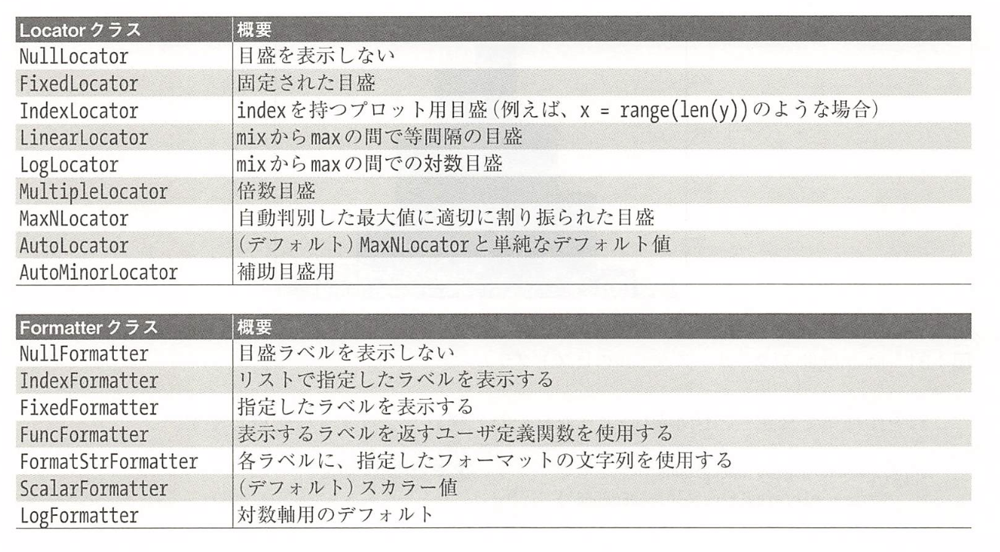

# Matplotlib による可視化
- [ggplot2](https://github.com/tidyverse/ggplot2)
- [HoloViews](http://holoviews.org/)
- [Altair](https://altair-viz.github.io/)

## 4.1 Matplotlib の基礎知識
### 4.1.1 matplotlib のインポート

```python
import matplotlib as mpl
import matplotlib.pyplot as plt
```

### 4.1.2 スタイルの設定

```python
plt.style.use('classic')
```

### 4.1.3 show() するか show() しないか？ 描画を表示する方法
#### 4.1.3.1 Python スクリプトからプロットする

```python
import matplotlib.pyplot as plt
import numpy as np

x = np.linspace(0, 10, 100)

plt.plot(x, np.sin(x))
plt.plot(x, np.cos(x))

plt.show()
```

```shell
$ python myplot.py
```

#### 4.1.3.2 IPythonシェルからプロットする

```python
%matplotlib

import matplotlib.pyplot as plt
```

#### 4.1.3.3 IPython notebook からプロットする

```python
import numpy as np
x = np.linspace(0, 10, 100)

fig = plt.figure()
plt.plot(x, np.sin(x), '-')
plt.plot(x, np.cos(x), '--')
```

### 4.1.4 プロット結果のファイル保存

```python
fig.savefig('my_figure.png')
```

```python
from IPython.display import Image
Image('my_figure.png')
```

```python
fig.canvas.get_supported_filetypes()
```

## 4.2 同じ結果を得る２つのインターフェース

#### 4.2.0.1 MATLABスタイルフェース
MATLABスタイルのツールは pyplot (plt)インターフェースで提供されています

```python
# figureを作成する
plt.figure()

# 最初のグラフを作成し, 現在の座標軸に設定する
plt.subplot(2, 1, 1)
plt.plot(x, np.sin(x))

# 2番目のグラフを作成して, 現在の座標軸に設定する
plt.subplot(2, 1, 2)
plt.plot(x, np.cos(x))
```

- `plt.gcf()` （get current figure: 現在の figure の取得）
- `plt.gca()` （get current axes: 現在の座標軸の取得）

#### 4.2.0.2 オブジェクト指向インターフェース

```python
# 最初にプロットのグリッドを作成する
# axは, 2つの座標軸オブジェクトの配列
fig, ax = plt.subplots(2)

# オブジェクトの plot() メソッドをコールする
ax[0].plot(x, np.sin(x))
ax[1].plot(x, np.cos(x))
```

## 4.3 単純な線グラフ

```python
import matplotlib as plt
plt.style.use('seaborn-whitegrid')
import numpy as np
```

figure は, 軸, グラフィックス, テキスト, ラベルなど, すべてのオブジェクトを含む1つのコンテナと考えることができます.
axes は上に示した通り, 目盛とラベルを持つ境界です

```python
fig = plt.figure()
ax = plt.axes()

x = np.linspace(0, 10, 1000)
ax.plot(x, np.sin(x))
```

```python
# pylabインターフェース
plt.plot(x, np.sin(x))
plt.plot(x, np.cos(x))
```

### 4.3.1 プロットの制御: 線の色とスタイル

```python
plt.plot(x, np.sin(x - 0), color='blue')
plt.plot(x, np.sin(x - 1), color='g')
plt.plot(x, np.sin(x - 2), color='0.75')
plt.plot(x, np.sin(x - 3), color='#ffdd44')
plt.plot(x, np.sin(x - 4), color=(1.0, 0.2, 0.3))
plt.plot(x, np.sin(x - 5), color='chartreuse')

# linestyle
plt.plot(x, x + 0, linestyle='solid')
plt.plot(x, x + 1, linestyle='dashed')
plt.plot(x, x + 2, linestyle='dashdot')
plt.plot(x, x + 3, linestyle='dotted')

plt.plot(x, x + 4, linestyle='-')
plt.plot(x, x + 5, linestyle='--')
plt.plot(x, x + 6, linestyle='-.')
plt.plot(x, x + 7, linestyle=':')

plt.plot(x, x + 0, '-g') # solid green
plt.plot(x, x + 1, '--c') # dashed cyan
plt.plot(x, x + 2, '-.k') # dashdot black
plt.plot(x, x + 3, ':r') # dotted red
```

### 4.3.2 プロットの制御: 座標軸の範囲

```python
plt.plot(x, np.sin(x))

plt.xlim(-1, 11)
plt.ylim(-1.5, 1.5)
```

軸を逆にしたい場合
```python
plt.plot(x, np.sin(x))

plt.xlim(10, 0)
plt.ylim(1.2, -1.2)
```

[plt.axis()](https://matplotlib.org/3.1.1/api/_as_gen/matplotlib.pyplot.axis.html?highlight=axis#matplotlib.pyplot.axis)<br>
* axes は axis （座標軸）の複数形
```python
plt.plot(x, np.sin(x))
plt.axis([-1, 11, -1.5, 1.5])
```

plt.axis() のさらに有益な使い方
```python
plt.plot(x, np.sin())
plt.axis('tight')
```

```python
plt.plot(x, np.sin(x))
plt.axis('equal')
```

### 4.3.3 プロットへのラベル付け

```python
plt.plot(x, np.sin(x))
plt.title('A Sine Curve')
plt.xlabel('x')
plt.ylabel('sin(x)')
```

```python
plt.plot(x, np.sin(x), '-g', label='sin(x)')
plt.plot(x, np.cos(x), ':b', label='cos(x)')
plt.axis('equal')

plt.legend()
```

**Matplotlib雑学**

- `plt.xlabel()` → `ax.set_xlabel()`
- `plt.ylabel()` → `ax.set_ylabel()`
- `plt.xlim()` → `ax.set_xlim()`
- `plt.ylim()` → `ax.set_ylim()`
- `plt.title()` → `ax.set_title()`

```python
ax = plt.axes()
ax.plot(x, np.sin(x))
ax.set(
    xlim=(0, 10),
    ylim=(-2, 2),
    xlabel='x',
    ylabel='sin(x)',
    title='A Simple Plot'
)
```

## 4.4 単純な散布図

```python
%matplotlib inline
import matplotlib.pyplot as plt
plt.style.use('seaborn-whitegrid')
import numpy as np
```

### 4.4.1 plt.plot を使った散布図

```python
x = np.linspace(0, 10, 30)
y = np.sin(x)
plt.plot(x, y, 'o', color='black')
```

```python
rng = np.random.RandomState(0)
for marker in ['o', '.', ',', 'x', '+', 'v', '^', '<', '>', 's', 'd']:
    plt.plot(rng.rand(5), rng.rand(5), marker, label="marker='{0}'".format(marker))
plt.legend(numpoints=1)
plt.xlim(0, 1.8)

plt.plot(x, y, '-ok') # line(-) circle marker(0), black(k)
```

```python
plt.plot(x, y, '-p', color='gray',
    markersize=15, linewidth=4,
    markerfacecolor='white',
    markeredgecolor='gray',
    markeredgewidth=2
)
plt.ylim(-1.2, 1.2)
```

[matplotlib.pyplot](https://matplotlib.org/3.1.0/api/_as_gen/matplotlib.pyplot.plot.html)

### 4.4.2 plt.scatter を使った散布図

```python
x = rng.randn(100)
y = rng.randn(100)
colors = rng.rand(100)
sizes = 1000 * rng.rand(100)

plt.scatter(x, y, c=colors, s=sizes, alpha=0.3, cmap='viridis')
plt.colorbar()
```

```python
from sklearn.datasets import load_iris
iris = load_iris()
features = iris.data.T

plt.scatter(features[0], features[1], alpha=0.2,
    s=100 * features[3], c=iris.target, cmap='viridis')
plt.xlabel(iris.feature_names[0])
plt.ylabel(iris.feature_names[1])
```

### 4.4.3 plot メソッド対scatterメソッド: 効率に関する注意点
データセットが数千ポイントを超えると、plt.plotはplt.scatterよりもずっと効率的です。

## 4.5 誤差の可視化
### 4.5.1 基本的なエラーバー

```python
%matplotlib inline
import matplotlib.pyplot as plt
plt.style.use('seaborn-whitegrid')
import numpy as np

x = np.linspace(0, 10, 50)
dy = 0.8
y = np.sin(x) + dy * np.random.randn(50)

plt.errorbar(x, y, yerr=dy, fmt='.k')
```

```python
plt.errorbar(x, y, yerr=dy, fmt='o', color='black', ecolor='lightgray', elinewidth=3, capsize=0)
```

### 4.5.2 連続誤差

```python
from sklearn.gaussian_process import GaussianProcess
model = lambda x: x * np.sin(x)
xdata = np.array([1,3,5,6,8])
ydata = model(xdata)

gp = GaussianProcess(corr='cubic', theta0=13-2, thetaU=1E-1, random_start=100)
gp.fit(xdata[:, np.newaxis], ydata)

xfit = np.linspace(0, 10, 1000)
yfit, MSE = gp.predict(xfit[:, np.newaxis], eval_MSE=True)
dyfit = 2 * np.sqrt(MSE) # 2*σつまり95%の信頼区間

# 結果を可視化する
plt.plot(xdata, ydata, 'or')
plt.plot(xfit, yfit, '-', color='gray')
plt.fil_between(xfit, yfit - dyfit, yfit + dyfit, color='gray', alpha=0.2)
plt.xlim(0, 10)
```

## 4.6 密度と等高線図

```python
% matplotlib inline 
import matplotlib.pyplot as plt
plt.style.use('seaborn-white')
import numpy as np
```

### 4.6.1 ３次元関数の可視化

```python
def f(x, y):
    return np.sin(x) ** 10 + np.cos(10 + y * x) * np.cos(x)
```

等高線図は plt.contour関数を使用して作成できます

```python
x = np.linspace(0, 5, 50)
y = np.linspace(0, 5, 40)
X, Y = np.meshgrid(x, y)
Z = f(X, Y)

plt.contour(X, Y, Z, colors='black')
```

```python
plt.contour(X, Y, Z, 20, cmap='RdGy')
```

```python
plt.contourf(X, Y, Z, 20, cmap='RdGy')
plt.colorbar()
```

```python
plt.imshow(Z, extent=[0, 5, 0, 5], origin='lower', cmap='RdGy')
plt.colorbar()
plt.axis(aspect='image')
```

```python
contours = plt.contour(X, Y, Z, 3, colors='black')
plt.clabel(contours, inline=True, fontsize=8)
plt.imshow(Z, extent=[0, 5, 0, 5], origin='lower', cmap='RdGy', alpha=0.5)
plt.colorbar()
```

## 4.7 ヒストグラム、ビニング、密度

```python
%matplotlib inline
import numpy as np
import matplotlib.pyplot as plt
plt.style.use('seaborn-white')

data = np.random.randn(1000)

plt.hist(data)
```

```python
plt.hist(data, bins=30, normed=True, alpha=0.5, histtype='stepfilled', color='steelblue', edgecolor='none')
```

```phthon
x1 = np.random.normal(0, 0.8, 1000)
x2 = np.random.normal(-2, 1, 1000)
x3 = np.random.normal(3, 2, 1000)

kwargs = dict(histtype='stepfilled', alpha=0.3, normed=True, bins=40)

plt.hist(x1, **kwargs)
plt.hist(x2, **kwargs)
plt.hist(x3, **kwargs)
```

ヒストグラムの計算だけを行い、表示をしないのであれば、np.histogram()関数が利用できます
```python
counts, bin_edges = np.histogram(data, bins=5)
print(counts)
```

### 4.7.1 ２次元ヒストグラムとビニング

```python
# 多変量ガウス分布から得られたxおよびy配列のデータを定義します
mean = [0, 0]
cov = [[1, 1], [1, 2]]
x, y = np.random.multivariate_normal(mean, cov, 10000).T
```

#### 4.7.1.1 plt.hist2d: 2次元ヒストグラム

```python
plt.hist2d(x, y, bins=30, cmap='Blues')
cb = plt.colorbar()
```

```python
counts, xedges, yedges = np.histogram2d(x, y, bins=30)
```

#### 4.7.1.2 plt.hexbin: 六角形のビニング

```python
plt.hexbin(x, y, gridsize=30, cmap='Blues')
cb = plt.colorbar(label='count in bin')
```

#### 4.7.1.3 カーネル密度推定

```python
from scipy.stats import gaussian_kde

# 配列のサイズを[N次元, Nサンプル]に揃える
data = np.vstack([x, y])
kde = gaussian_kde(data)

# 均一なグリッドで評価する
xgrid = np.linspace(-3.5, 3.5, 40)
ygrid = np.linspace(-6, 6, 40)
Xgrid, Ygrid = np.meshgrid(xgrid, ygrid)
Z = kde.evaluate(np.vstack([Xgrid.ravel(), Ygrid.ravel()]))

# 結果をイメージとして表示する
plt.imshow(Z.reshape(Xgrid.shape), 
    origin='lower', aspect='auto',
    extent=[-3.5, 3.5, -6, 6],
    cmap='Blues'
)
cb = plt.colorbar()
cb.set_label('density')
```

## 4.8 凡例のカスタマイズ

```python
import matplotlib.pyplot as plt
plt.style.use('classic')

%matplotlib inline
import numpy as np

x = np.linspace(0, 10, 1000)
fig, ax = plt.subplots()
ax.plot(x, np.sin(x), '-b', label='Sine')
ax.plot(x, np.cos(x), '--r', label='Cosine')
ax.axis('equal')
leg = ax.legend()

# 位置を指定して枠線を消す
ax.legend(loc='upper left', frameon=False)

ax.legend(frameon=False, loc='lower center', ncol=2)

ax.legend(fancybox=True, framealpha=1, shadow=True, borderpad=1)
```

### 4.8.1 汎用要素の選択

```python
y = np.sin(x[:, np.newaxis] + np.pi * np.arange(0, 2, 0.5))
lines = plt.plot(x, y)

# lines は plt.line2Dインスタンスのリスト
plt.legend(lines[:2], ['first', 'second'])

# 実際には, プロット要素にラベルを付加しておくのが明快です
plt.plot(x, y[:, 0], label='first')
plt.plot(x, y[:, 1], label='second')
plt.plot(x, y[:, 2:])
plt.legend(framealpha=1, frameon=True)
```

### 4.8.2 点サイズの凡例

```python
import pandas as pd
cities = pd.read_csv('data/california_cities.csv')

# 着目しているデータを抜き出す
lat, lon = cities['latd'], cities['longd']
population, area = cities['population_total'], cities['area_total_km2']

# 各地点に色と大きさを指定した散布図をプロットする, ラベルは付加しない
plt.scatter(lon, lat, label=None,
    c=np.log10(population), cmap='viridis',
    s=area, linewidth=0, alpha=0.5)
plt.axis(aspect='equal')
plt.xlabel('longitude')
plt.ylabel('latitude')
plt.colorbar(label='log$_{10}$(population)')
plt.clim(3, 7)

# 凡例を加える
# 点の大きさとラベルを指定した上で, 空のリストをプロットする
for area in [100, 300, 500]:
    plt.scatter([], [], c='k', alpha=0.3, s=area, label=str(area) + ' km$^2$')

plt.legend(scatterpoints=1, frameon=False, labelspacing=1, title='City Area')
plt.title('California Cities: Area and Population')
```

### 4.8.3 複数の凡例

```python
fig, ax = plt.subplots()
lines = []
styles = ['-', '--', '-.', ':']
x = np.linspace(0, 10, 1000)

for i in range(4):
    lines += ax.plot(x, np.sin(x - i * np.pi / 2), styles[i], color='black')

ax.axis('equal')

# 1つ目の判例の行とラベルを指定する
ax.legend(lines[:2], ['line A', 'line B'], loc='upper right', frameon=False)

# 2つ目の判例を生成し, その artist インスタンスを手動で追加する
from matplotlib.legend import Legend
leg = Legend(ax, lines[2:], ['line C', 'line D'], loc='lower right', frameon=False)
ax.add_artist(leg)
```

## 4.9 カラーバーのカスタマイズ

```python
import matplotlib.pyplot as plt
plt.style.use('classic')

%matplotlib inline
import numpy as np

x = np.linspace(0, 10, 1000)
I = np.sin(x) * np.cos(x[:, np.newaxis])

plt.imshow(I)
plt.colorbar()
```

### 4.9.1 カラーバーのカスタマイズ

```python
plt.imshow(I, cmap='gray')

# 利用可能なカラーマップはすべて plt.cm 名前空間にあります
plt.cm.<TAB>
```

#### 4.9.1.1 カラーマップの選択
カラーマップの３つのカテゴリ
1. 順次的カラーマップ（binary, viridis）
2. 発散的カラーマップ（RdBu, PuOr）
3. 定性的カラーマップ（rainbow, jet）

```python
from matplotlib.colors import LinearSegmentedColormap

def grayscale_cmap(cmap):
    """渡されたカラーマップのグレースケール版を返す"""
    
    cmap = plt.cm.get_cmap(cmap)
    colors = cmap(np.arange(cmap.N))
    
    # RGBAを知覚輝度に変換する
    # http://alienryderflex.com/hsp.html を参照
    RGB_weight = [0.299, 0.587, 0.114]
    luminance = np.sqrt(np.dot(colors[:, :3] ** 2, RGB_weight))
    colors[:, :3] = luminance[:, np.newaxis]
    
    return LinearSegmentedColormap.from_list(cmap.name + '_gray', colors, cmap.N)


def view_colormap(cmap):
    """カラーマップをグレースケール版と並べて表示する"""
    
    cmap = plt.cm.get_cmap(cmap)
    colors = cmap(np.arange(cmap.N))
    
    cmap = grayscale_cmap(cmap)
    grayscale = cmap(np.arange(cmap.N))
    
    fig, ax = plt.subplots(2, figsize=(6, 2),
        subplot_kw=dict(xticks=[], yticks=[]))
    ax[0].imshow([colors], extent=[0, 10, 0, 1])
    ax[1].imshow([grayscale], extent=[0, 10, 0, 1])

view_colormap('jet')
view_colormap('viridis')
view_colormap('cubehelix')
view_colormap('RdBu')
```

#### 4.9.1.2 色の範囲制限と拡張
カラーバーは plt.Axes のインスタンス

```python
# 画像のピクセルに1%のノイズを乗せる
speckles = (np.random.random(I.shape) < 0.01)
I[speckles] = np.random.normal(0, 3, np.count_nonzero(speckles))

plt.figure(figsize=(10, 3.5))

plt.subplot(1, 2, 1)
plt.imshow(I, cmap='RdBu')
plt.colorbar()

plt.subplot(1, 2, 2)
plt.imshow(I, cmap='RdBu')
plt.colorbar(extend='both')
plt.clim(-1, 1)
```

#### 4.9.1.3 離散的カラーバー

```python
plt.imshow(I, cmap=plt.cm.get_cmap('Blues', 6))
plt.colorbar()
plt.clim(-1, 1)
```

### 4.9.2 事例: 手書きの数字

```python
# 0から5までの数字イメージデータをロードし, そのうちのいくつかを表示する
from sklearn.datasets import load_digits
digits = load_digits(n_class=6)

fig, ax = plt.subplots(8, 8, figsize=(6, 6))
for i, axi in enumerate(ax.flat):
    axi.imshow(digits.images[i], cmap='binary')
    axi.set(xticks=[], yticks=[])
```

```python
# 数字データをIsomapを使用して2次元に投影する
from sklearn.manifold import Isomap
iso = Isomap(n_components=2)
projection = iso.fit_transform(digits.data)

# 結果のプロット
plt.scatter(projection[:, 0], projection[:, 1], lw=0.1,
    c=digits.target, cmap=plt.cm.get_cmap('cubehelix', 6))
plt.colorbar(ticks=range(6), label='digits value')
plt.clim(-0.5, 5.5)
```

## 4.10 複数のサブプロット

```python
%matplotlib inline
import matplotlib.pyplot as plt
plt.style.use('seaborn-white')
import numpy as np
```

### 4.10.1 plt.axes サブプロットのマニュアル作成
plt.axesメソッドを使用するのが, 軸を作成するもっとも基本的な方法です

```python
ax1 = plt.axes() # 標準の軸
ax2 = plt.axes([0.65, 0.65, 0.2, 0.2])
```

オブジェクト指向でIFこのメソッドに相当するのは fig.add_axes() です

```python
fig = plt.figure()
ax1 = fig.add_axes([0.1, 0.5, 0.8, 0.4], xticklabels=[], ylim=(-1.2, 1.2))
ax2 = fig.add_axes([0.1, 0.1, 0.8, 0.4], ylim=(-1.2, 1.2))

x = np.linspace(0, 10)
ax1.plot(np.sin(x))
ax2.plot(np.cos(x))
```

### 4.10.2 plt.subplot: サブプロットの単純なグリッド

```python
for i in range(1, 7):
    plt.subplot(2, 3, i)
    plt.text(0.5, 0.5, str((2, 3, i)), fontsize=18, ha='center')
```

plt.subplots_adjust() メソッドを利用して, プロットの間隔をできます

```python
fig = plt.figure()
fig.subplots_adjust(hspace=0.4, wspace=0.4)

for i in range(1, 7):
    ax = fig.add_subplot(2, 3, i)
    ax.text(0.5, 0.5, str((2, 3, i)), fontsize=18, ha='center')
```

### 4.10.3 plt.subplots: グリッド全体を一度に作成する

```python
# x軸とy軸を共有した plt.subplots()
fig, ax = plt.subplots(2, 3, sharex='col', sharey='row')

# ax は２次元配列として[行, 列]で指定可能
for i in range(2):
    for j in range(3):
        ax[i, j].text(0.5, 0.5, str((i, j)), fontsize=18, ha='center') # <-
```

### 4.10.4 pltGridSpec: より複雑な配置
複数の行や列にまたがるサブプロットを作るには plt.GridSpec() が最適なツールです

```python
grid = plt.GridSpec(2, 3, wspace=0.4, hspace=0.3)

plt.subplot(grid[0, 0])
plt.subplot(grid[0, 1:])
plt.subplot(grid[1, :2])
plt.subplot(grid[1, 2])
```

```python
# 正規分布データを作成
mean = [0, 0]
cov = [[1, 1], [1, 2]]
x, y = np.random.multivariate_normal(mean, cov, 3000).T

# gridspecによる軸配列を作成
fig = plt.figure(figsize=(6, 6))
grid = plt.GridSpec(4, 4, hspace=0.2, wspace=0.2)
main_ax = fig.add_subplot(grid[:-1, 1:])
y_hist = fig.add_subplot(grid[:-1, 0], xticklabels=[], sharey=main_ax)
x_hist = fig.add_subplot(grid[-1, 1:], yticklabels=[], sharex=main_ax)

# scatter points on the main axes
main_ax.plot(x, y, 'ok', markersize=3, alpha=0.2)

# histogram on the attached axes
x_hist.hist(x, 40, histtype='stepfilled', orientation='vertical', color='gray')
x_hist.invert_yaxis()

y_hist.hist(y, 40, histtype='stepfilled', orientation='horizontal', color='gray')
y_hist.invert_xaxis()
```

## 4.11 テキストと注釈

```python
%matplotlib inline
import matplotlib.pyplot as plt
import matplotlib as mpl
plt.style.use('seaborn-whitegrid')
import numpy as np
import pandas as pd
```

### 4.11.1 事例: 米国出生率における休日の影響

```python
births = pd.read_csv('births.csv')

quartiles = np.percentile(births['births'], [25, 50, 75])
mu, sig = quartiles[1], 0.74 * (quartiles[2] - quartiles[0])
births = births.query('(births > @mu - 5 * @sig) & (births < @mu + 5 * @sig)')

births['day'] = births['day'].astype(int)

births.index = pd.to_datetime(10000 * births.year + 100 * births.month + births.day, format='%Y%m%d')
births_by_date = births.pivot_table('births', [births.index.month, births.index.day])
births_by_date.index = [pd.datetime(2012, month, day) for (month, day) in births_by_date.index]

fig, ax = plt.subplots(figsize=(12, 4))
births_by_date.plot(ax=ax)
```
plt.text / ax.text
```python
fig, ax = plot.subplots(figsize=(12, 4))
births_by_date.plot(ax=ax)

# プロットにラベルを付加する
style = dict(size=10, color='gray')

ax.text('2012-1-1', 3950, 'New Year\'s Day', **style)
ax.text('2012-7-4', 4250, 'Independence Day', ha='center', **style)
ax.text('2012-9-4', 4850, 'Labor Day', ha='center', **style)
ax.text('2012-10-31', 4600, 'Holloween', ha='center', **style)
ax.text('2012-11-25', 4450, 'Thanksgiving', ha='center', **style)
ax.text('2012-12-25', 3850, 'Christmas', ha='center', **style)

# 軸ラベルを追加
ax.set(title='USA births by day of year (10969-1988)', ylabel='average daily births')

# x軸に月のラベルをセンタリングして配置
ax.xaxis.set_major_locator(mpl.dates.MonthLocator())
ax.xaxis.set_minor_locator(mpl.dates.MonthLocator(bymonthday=15))
ax.xaxis.set_major_formatter(plt.NullFormatter())
ax.xaxis.set_minor_formatter(mpl.dates.DateFormatter('%h'))
```

### 4.11.2 テキスト位置の変換

- ax.transData: データ座標軸に関連つけられた変換
- ax.transAxes: （軸の次元の単位で）軸に関連づけられた変換
- fig.transFigure: （figureの次元の単位で） figureに関連づけられた変換

```python
fig, ax = plt.subplots(facecolor='lightgray')
ax.axis([0, 10, 0, 10])

# transform=ax, transData はデフォルトであるが, 他との比較のためあえて指定
ax.text(1, 5, ". Data: (1, 5)", transform=ax.transData)
ax.text(0.5, 0.1, ". Axes: (0.5, 0.1)", transform=ax.transAxes)
ax.text(0.2, 0.2, ". Figure: (0.2, 0.2)", transform=fig.transFigure)

# 軸の範囲を変更する, transData の座標だけが影響を受ける
ax.set_xlim(0, 2) 
ax.set_ylim(-6, 6)
```

### 4.11.3 矢印と注釈
plt.annotate()

```python
%matplotlib inline

fig, ax = plt.subplots()

x = np.linspace(0, 20, 1000)
ax.plot(x, np.cos(x))
ax.axis('equal')

ax.annotate('local maximum', xy=(6.28, 1), xytext=(10, 4), arrowprops=dict(facecolor='black', shrink=0.05))

ax.annotate('local minimum', xy=(5 * np.pi, -1), xytext=(2, -6),
    arrowprops=dict(arrowstyle='->',
        connectionstyle='angle3,angleA=0,angleB=-90'))
```


```python
fig, ax = plt.subplots(figsize=(12, 4))
births_by_date.plot(ax=ax)

# プロットにラベルを追加
ax.annotate('New Year\'s Day', xy=('2012-1-1', 4100), xycoords='data',
    xytext=(50, -30), textcoords='offset points',
    arrowprops=dict(arrowstyle='->',
        connectionstyle='arc3,rad=-0.2'))

ax.annotate('Independence Day', xy=('2012-7-4', 4250), xycoords='data',
    bbox=dict(boxstyle='round', fc='none', ec='gray'),
    xytext=(10, -40), textcoords='offset points', ha='center',
    arrowprops=dict(arrowstyle='->'))

ax.annotate('Labor Day', xy=('2012-9-4', 4850), xycoords='data', ha='center',
    xytext=(0, -20), textcoords='offset points')

ax.annotate('', xy=('2012-9-1', 4850), xytext=('2012-9-7', 4850), xycoords='data', ha='center',
    arrowprops={'arrowstyle': '|-|,widthA=0.2,widthB=0.2'})

ax.annotate('Halloween', xy=('2012-10-31', 4600), xycoords='data',
    xytext=(-80, -40), textcoords='offset points',
    arrowprops=dict(arrowstyle='fancy',
        fc='0.6', ec='none',
        connectionstyle='angle3,angleA=0,angleB=-90'))

ax.annotate('Thanksgiving', xy=('2012-11-25', 4500), xycoords='data',
    xytext=(-120, -60), textcoords='offset points',
    bbox=dict(boxstyle='round4,pad=.5', fc='0.9'),
    arrowprops=dict(arrowstyle='->', 
        connectionstyle='angle,angleA=0,angleB=80,rad=20'))

ax.annotate('Chirstmas', xy=('2012-12-25', 3850), xycoords='data',
    xytext=(-30, 0), textcoords='offset points',
    size=13, ha='right', va='center',
    bbox=dict(boxstyle='round', alpha=0.1),
    arrowprops=dict(arrowstyle='wedge,tail_width=0.5', alpha=0.1))

# 軸ラベルの設定
ax.set(title='USA births by day of year(1969-1988)', ylabel='average daily births')

# x軸に月のラベルをセンタリングして配置
ax.xaxis.set_major_locator(mpl.dates.MonthLocator())
ax.xaxis.set_minor_locator(mpl.dates.MonthLocator(bymonthday=15))
ax.xaxis.set_major_formatter(plt.NullFormatter())
ax.xaxis.set_minor_formatter(mpl.dates.DateFormatter('%h'))
ax.set_ylim(3600, 5400)
```

https://matplotlib.org/examples/pylab_examples/annotation_demo2.html

## 4.12 メモリのカスタマイズ
### 4.12.1 主目盛と補助目盛

```python
%matplotlib inline
import matplotlib.pyplot as plt
plt.style.use('classic')
import numpy as np

ax = plt.axes(xscale='log', yscale='log', xlim=[1E-7, 1E-1], ylim=[1E-7, 1E-1])
ax.grid()

print(ax.xaxis.get_major_locator())
print(ax.xaxis.get_minor_locator())

print(ax.xaxis.get_major_formatter())
print(ax.xaxis.get_minor_formatter())
```

### 4.12.2 非表示の目盛とラベル
plt.NullLocator() / plt.NullFormatter()

```python
ax = plt.axes()
ax.plot(np.random.rand(50))

# x軸から（目盛と目盛り線は残して）ラベルを削除し,
# y軸から目盛を削除
ax.yaxis.set_major_locator(plt.NullLocator())
ax.xaxis.set_major_formatter(plt.NullFormatter())
ax.xaxis.set_minor_locator(plt.NullLocator())
```

```python
fig, ax = plt.subplots(5, 5, figsize=(5, 5))
fig.subplots_adjust(hspace=0, wspace=0)

# 顔の画像を scikit-learn から取得する
from sklearn.datasets import fetch_olivetti_faces
faces = fetch_olivetti_faces().images

for i in range(5):
    for j in range(5):
        ax[i, j].xaxis.set_major_locator(plt.NullLocator())
        ax[i, j].yaxis.set_major_locator(plt.NullLocator())
        ax[i, j].imshow(faces[10 * i + j], cmap='bone')
```

### 4.12.3 目盛の増減と削減

小さなプロットに多数のラベルがついてしまうことへの対処

```python
fig, ax = plt.subplots(4,4, sharex=True, sharey=True)

# xとy軸それぞれに主目盛を設定する
for axi in ax.flat:
    axi.xaxis.set_major_locator(plt.MaxNLocator(3))
    axi.yaxis.set_major_locator(plt.MaxNLocator(3))
```

### 4.12.4 目盛のフォーマットの調整

```python
# 正弦と余弦をプロットする
fig, ax = plt.subplots()
x = np.linspace(0, 3 * np.pi, 1000)
ax.plot(x, np.sin(x), lw=3, label='Sine')
ax.plot(x, np.cos(x), lw=3, label='Cosine')

# グリッド、凡例、範囲を設置する
ax.grid(True)
ax.legend(frameon=False)
ax.axis('equal')
ax.set_xlim(0, 3 * np.pi)

ax.xaxis.set_major_locator(plt.MultipleLocator(np.pi / 2))
ax.xaxis.set_monor_locator(plt.MultipleLocator(np.pi / 4))

def format_func(value, tick_number):
    # pi / 2 の何倍かを見分ける
    N = int(np.round(2 * value / np.pi))
    if N == 0:
        return '0'
    elif N == 1:
        return r'$\pi/2$'
    elif N == 2:
        return r'$\pi$'
    elif N ==2 > 0:
        return r'${0}\pi/2$'.format(N)
    else:
        return r'${0}\pi$'.format(N // 2)

ax.xaxis.set_major_formatter(plt.FuncFormatter(format_func))
```

> 文字列をドル記号で囲んで指定するLaTeXサポートを利用しています。こうして数学記号や数式が表示できます

### 4.12.5 Formatter と Locator のまとめ



## 4.13 Matplotlib のカスタマイズ: 設定とスタイルシート

### 4.13.1 手作業でカスタマイズ

```python
import matplotlib.pyplot as plt
plt.style.use('classic')
import numpy as np

%matplotlib inline

x = np.random.randn(1000)
plt.hist(x)

# 背景をグレーに設定
ax = plt.axes(facecolor='#e6e6e6')
ax.set_axisbelow(True)

# グリッド線を白の実践に
plt.grid(color='w', linestyle='solid')

# 上と右の目盛を非表示
ax.xaxis.tick_bottom()
ax.yaxis.tick_left()

# 目盛とラベルを明るい色に設定
ax.tick_params(colors='gray', direction='out')

for tick in ax.get_xticklabels():
    tick.set_color('gray')
for tick in ax.get_yticklabels():
    tick.set_color('gray')

# ヒストグラムの面と境界の色を設定
ax.hist(x, edgecolor='#e6e6e6', color='#ee6666')
```

### 4.13.2 デフォルトの変更: rcParams

```python
IPython_default = plt.rcParams.copy()

from matplotlib import cycler
colors = cycler('color',
    [
        '#ee6666', '#3388bb', '#9988dd',
        '#eecc55', '#88bb44', '#ffbbbb'
    ])
plt.rc('axes', facecolor='#e6e6e6', edgecolor='none',
    axisbelow=True, grid=True, prop_cycle=colors)
plt.rc('grid', color='w', linestyle='solid')
plt.rc('xtick', direction='out', color='gray')
plt.rc('ytick', direction='out', color='gray')
plt.rc('patch', edgecolor='#e6e6e6')
plt.rc('lines', linewidth=2)
```

```python
for i in range(4):
    plt.plot(np.random.rand(10))
```

### 4.13.3 スタイルシート
利用可能なスタイルの一覧が plt.style.available です

```python
plt.style.available[:-5]

plt.style.use('stylename')
```

```python
# スタイルを一時的に設定するなら、スタイル・コンテキスト・マネージャを使用します

with plt.style.context('stylename'):
    make_a_plot()
```

```python
def hist_and_lines():
    np.random.seed(0)
    fig, ax = plt.subplots(1, 2, figsize=(11,4))
    ax[0].hist(np.random.randn(1000))
    for i in range(3):
        ax[1].plot(np.random.rand(10))
    ax[1].legend(['a', 'b', 'c'], loc='lower left')
```

####  4.13.3.1 デフォルトスタイル

```python
# rcParams のリセット
plt.rcParams.update(IPython_default)
```

```python
hist_and_lines()

with plt.style.context('fivethirtyeight'):
    hist_and_lines()
```

#### 4.13.3.3 ggplot

```python
with plt.style.context('ggplot'):
    hist_and_lines()
```

#### 4.13.3.4 ハッカーのためのベイジアンメソッドスタイル

```python
with plt.style.context('bmh'):
    hist_and_lines()
```

#### 4.13.3.5 暗い背景スタイル

```python
with plt.style.context('dark_background'):
    hist_and_lines()
```

### 4.13.3.6 グレースケール

```python
with plt.style.context('grayscale'):
    hist_and_lines()
```

#### 4.13.3.7 Seaborn スタイル

```python
import seaborn
```

## 4.14 Matplotlib を使った３次元プロット

```python
from mpl_toolkits import mplot3d

%matplotlib inline
import numpy as np
import matplotlib.pyplot as plt

fig = plt.figure()
ax = plt.axes(projection='3d')
```

### 4.14.1 ３次元の点と線

```python
ax = plt.axes(projection='3d')

# ３次元曲線のデータ
zline = np.linspace(0, 15, 1000)
xline = np.sin(zline)
yline = np.cos(zline)
ax.plot3D(xline, yline, zline, 'gray')

# ３次元の点データ
zdata = 15 * np.random.random(100)
xdata = np.sin(zdata) + 0.1 * np.random.randn(100)
ydata = np.cos(zdata) + 0.1 * np.random.randn(100)
ax.scatter3D(xdata, ydata, zdata, c=zdata, cmap='Greens')
```

### 4.14.4 ３次元等高線図

```python
def f(x, y):
    return np.sin(np.sqrt(x ** 2 + y ** 2))

x = np.linspace(-6, 6, 30)
y = np.linspace(-6, 6, 30)
X, Y = np.meshgrid(x, y)
Z = f(X, Y)

fig = plt.figure()
ax = plt.axes(projection='3d')
ax.contour3D(X, Y, Z, 50, cmap='binary')
ax.set_xlabel('x')
ax.set_ylabel('y')
ax.set_zlabel('z')

ax.view_init(60, 35)
```

### 4.14.3 ワイヤーフレームとサーフェス

```python
fig = plt.figure()
ax = plt.axes(projection='3d')
ax.plot_wireframe(X, Y, Z, color='black')
ax.set_title('wireframe')
```

```python
ax = plt.axes(projection='3d')
ax.plot_surface(X, Y, Z, rstride=1, cstride=1,
    cmap='viridis', edgecolor='none')
```

```python
r = np.linspace(0, 6, 20)
theta = np.linspace(-0.9 * np.pi, 0.8 * np.pi, 40)
I, theta = np.meshgrid(r, theta)

X = r * np.sin(theta)
Y = r * np.cos(theta)
Z = f(X, Y)

ax = plt.axes(projection='3d')
ax.plot_surface(X, Y, Z, rstride=1, cstride=1,
    cmap='viridis', edgecolor='none')
```

### 4.14.4 三角形分割のサーフェス

```python
theta = 2 * np.pi * np.random.random(1000)
r = 6 * np.random.random(1000)
x = np.ravel(r * np.sin(theta))
y = np.ravel(r * np.cos(theta))
z = f(x, y)

ax = plt.axes(projection='3d')
ax.scatter(x, y, z, c=z, cmap='viridis', linewidth=0.5)

ax = plt.axes(projection='3d')
ax.plot_trisurf(x, y, z, cmap='viridis', edgecolor='none')
```

#### 4.14.4.1 事例: メビウスの輪の可視化

```python
theta = np.linspace(0, 2 * np.pi, 30)
w = np.linspace(-0.25, 0.25, 8)
w, theta = np.meshgrid(w, theta)

phi = 0.5 * theta

# x-y平面上での半径r
r = 1 + w * np.cos(phi)

x = np.ravel(r * np.cos(theta))
y = np.ravel(r * np.sin(theta))
z = np.ravel(w * np.sin(phi))

# パラメータから三角形分割を行う
from matplotlib.tri import Triangulation
tri = Triangulation(np.ravel(w), np.ravel(theta))

ax = plt.axes(projection='3d')
ax.plot_trisurf(x, y, z, triangles=tri.triangles,
    cmap='viridis', linewidth=0.2)

ax.set_xlim(-1, 1)
ax.set_ylim(-1, 1)
ax.set_zlim(-1, 1)
```

## 4.15 Basemap を使った地理データの処理
